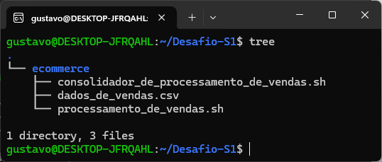
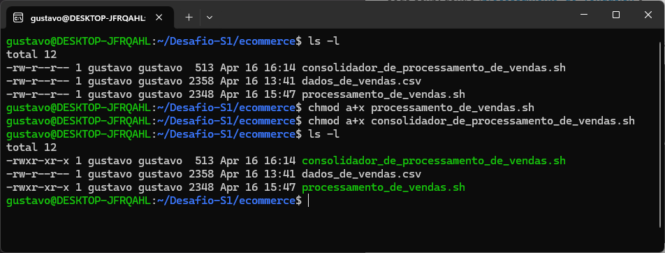
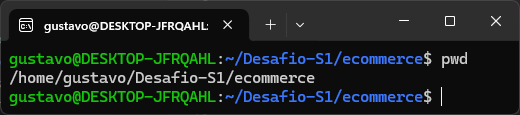
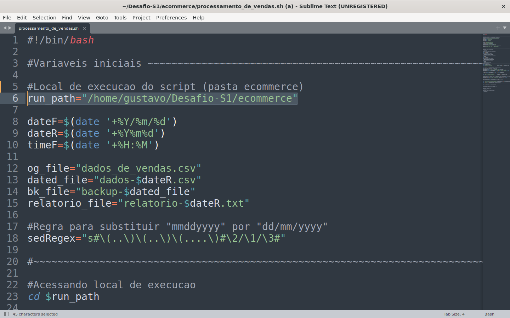
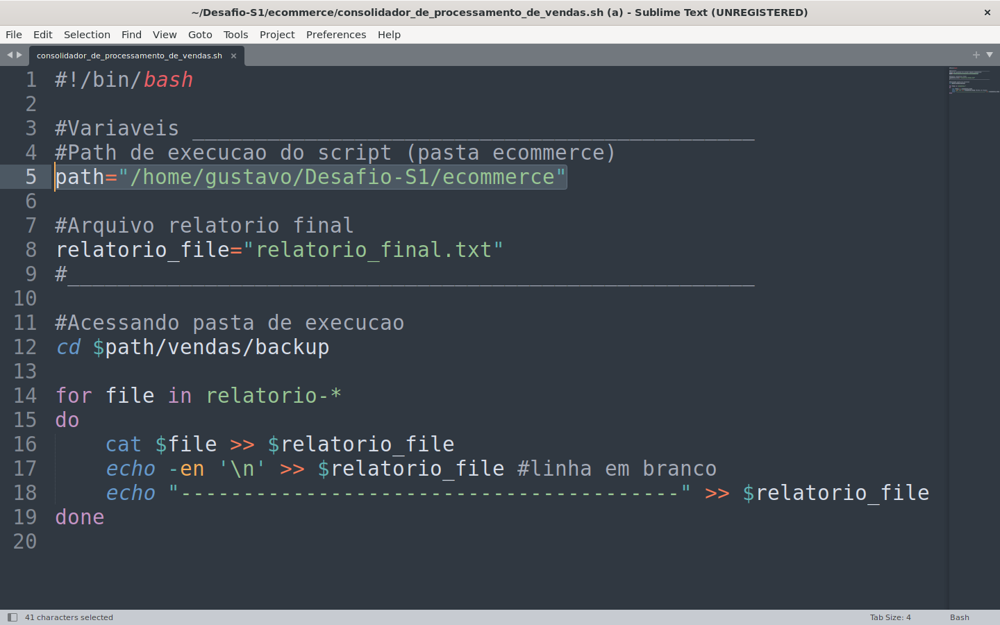
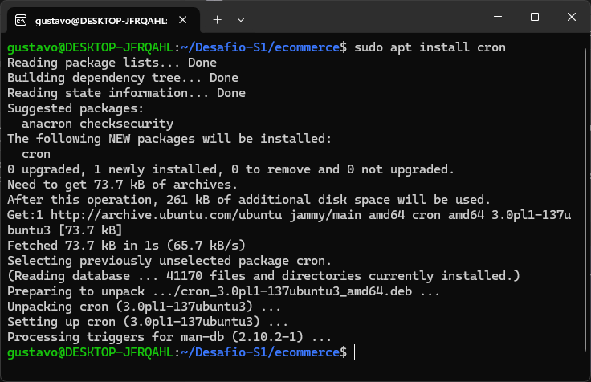
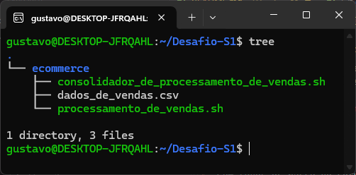
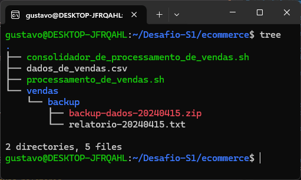
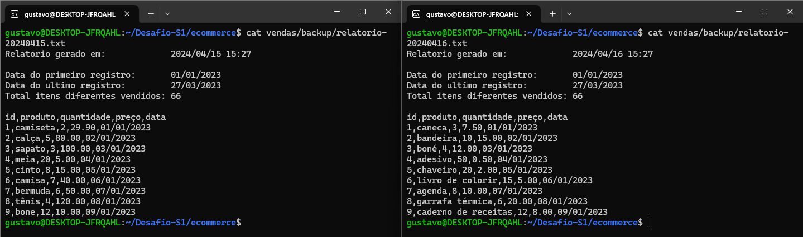

# Etapas

## 1. Setup inicial de arquivos

Comandos a serem utilizados nessa seção se encontram em [comandos.txt](Etapa-1/comandos.txt)

Dentro de uma pasta de preferência adicione a pasta [ecommerce](Etapa-1/ecommerce/) e seus script dentro ([processamento_de_vendas.sh](Etapa-1/ecommerce/processamento_de_vendas.sh) e [consolidador_de_processamento_de_vendas.sh](Etapa-1/ecommerce/consolidador_de_processamento_de_vendas.sh) )

Também adicione [dados_de_vendas-dia_1.csv](dados_de_vendas-dia_1.csv) a pasta com o nome "dados_de_vendas.csv"

Conceda permissão de execução para ambos os scripts

Dentro de um editor de texto altere a variável "path" em ambos os scripts para o local de execução desejado (pasta ecommerce)

## 2. Agendando execução do script
Comandos a serem utilizados nessa seção se encontram em [comandos.txt](Etapa-2/comandos.txt)

Instale o Cron utilizando o gerenciador de pacotes

Acesse o arquivo crontab e agende a execucao dos script para 15:27 de seg-sex

## 3. Execução

Com todos os passo de setup e agendamento prontos o projeto deve se parecer com isso:

_Estrutura do projeto antes de qualquer execução_

A única necessidade restante é a alteração do arquivo "ecommerce/dados_de_vendas.csv" após cada execução do script. Arquivos se encontram na pasta [Desafios](.) ([dia 2](dados_de_vendas-dia_2.csv), [dia 3](dados_de_vendas-dia_3.csv)).

_Estrutura  do projeto após primeira execução_

_Estrutura  do projeto após segunda execução_

_Diferença nos relatórios gerados_

Após todas as execuções automáticas do [processamento_de_ vendas.sh](Etapa-1/ecommerce/processamento_de_vendas.sh) podemos finalmente executar o [consolidamento_de_processamento_de_vendas.sh](Etapa-1/ecommerce/consolidador_de_processamento_de_vendas.sh)

_Execução do Consolidador de Vendas e Estrutura final do projeto_

#joaskdjaosjd
[Chat com geraçao dos novos csv](https://chat.openai.com/share/95544468-c001-474f-be19-ff94b385cd9b)

