# Etapas

## Contexto de Análise

Por muitas vezes confundimos animação como um gênero midiático, algo relacionado a escrita ou história contada. Entretanto, este formato audiovisual vem sendo desenvolvido desde 1982 e hoje ocupa diversas facetas do mercado audiovisual.

No Dashboard criado pretendo responder as seguintes questões:
1. Como a produção de animações vem evoluindo?
1. A produção de animações é lucrativa?
1. Quais são as ocupações existentes na produção de animações?
1. Podemos afirmar que animações são vistas com certo estigma? Apenas como um gênero infantojuvenil?

## Configurando Dataset 

Para criação do Dataset para a análise foi utilizado as tabelas criadas para camada refined na Sprint 9.
Também foi utilizado um dataset em CSV para [Mapeamento de Países](Country%20Mapping%20-%20ISO,%20Continent,%20Region.csv)  disponibiliado em [country-mapping-iso-continent-region](https://www.kaggle.com/datasets/andradaolteanu/country-mapping-iso-continent-region).

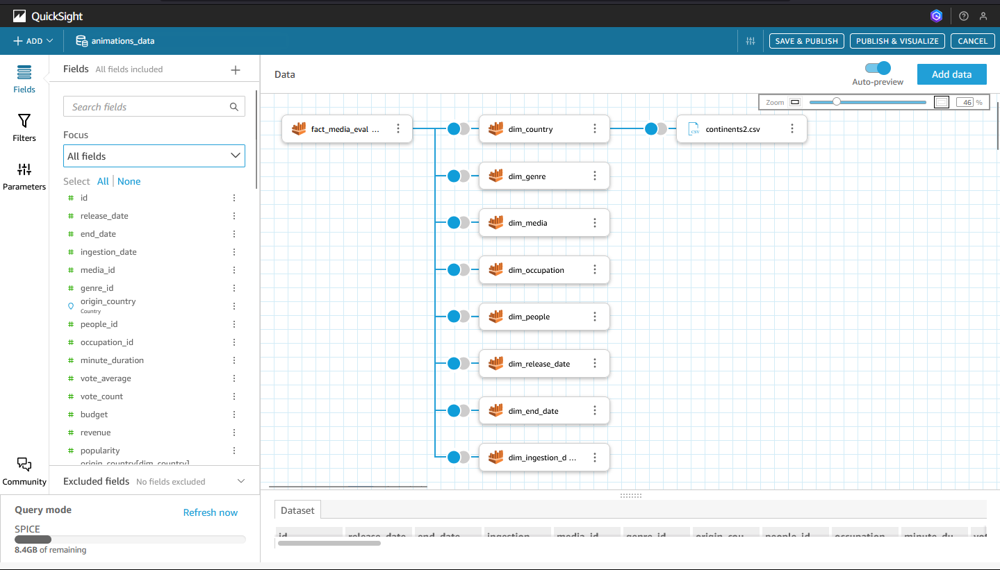
## Gráficos e Diagramas Utilizados

### Pontos em Mapa

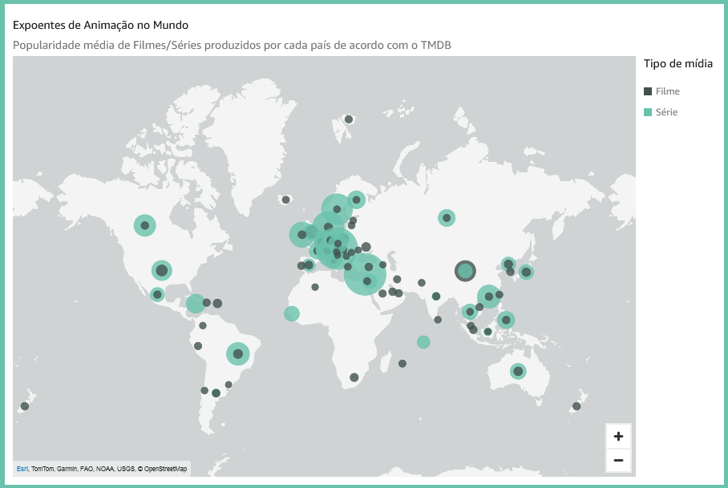

O gráfico ***"Pontos em Mapa"*** é usado para representar visualmente pontos de dados em um mapa. Ele pode ser usado para mostrar a distribuição ou concentração de determinados dados em diferentes localizações geográficas. 

No contexto da análise, esse gráfico foi usado para exibir média de popularidade de séries e filmes em cada localização.

### Tabelas

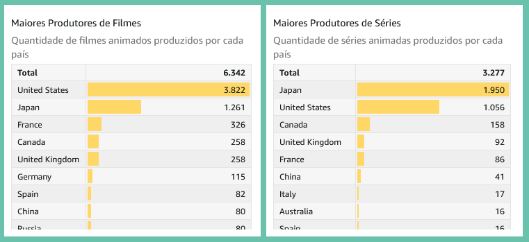

O gráfico ***"Tabelas"*** é usado para apresentar dados em formato tabular. É útil para exibir informações estruturadas com várias colunas e linhas. 

No contexto da análise, esse gráfico foi usado para relacionar a quantidade de mídias em cada país.

### Gráfico de Linha com Pequenos Múltiplos

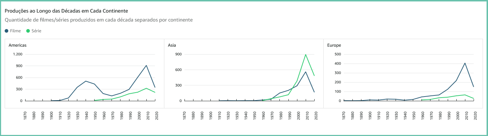

O gráfico ***"Gráfico de Linha com Pequenos Múltiplos"*** é usado para comparar a evolução de várias variáveis ao longo do tempo. 

No contexto da análise, esse gráfico foi usado para visualizar a evolução da quantidade de animações em diferentes regiões ao longo do tempo.

### Mapas de Árvore

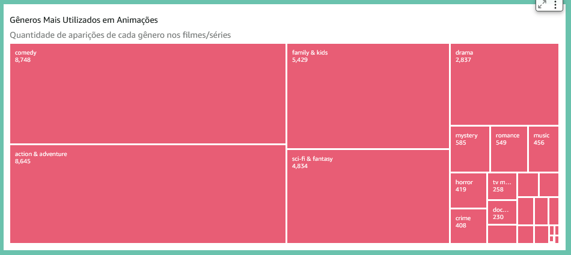
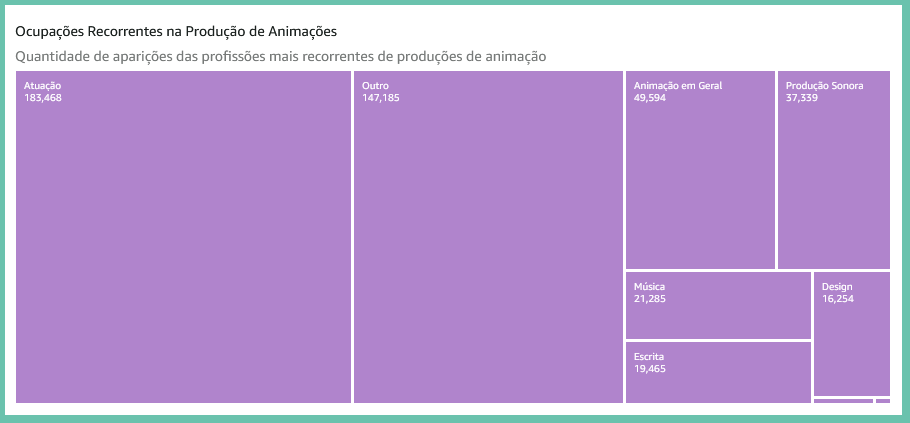

O gráfico ***"Mapas de Árvore"***, também conhecido como treemap, é usado para exibir dados hierárquicos usando retângulos aninhados. É útil para mostrar as proporções e relações entre diferentes categorias ou subcategorias. 

No contexto da análise, esses gráficos foram usados para representar a distribuição de gêneros de animação e ocupações recorrentes.

### Gráficos de Donut

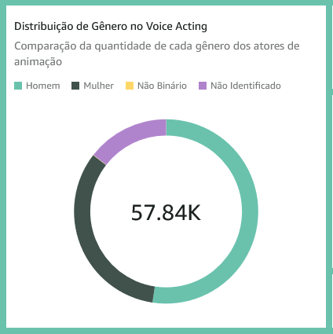
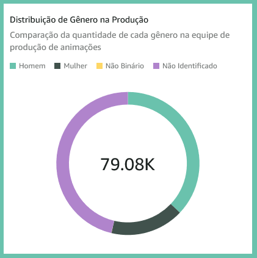

O gráfico ***"Gráficos de Donut"*** é usado para exibir dados como um círculo com um buraco no centro. É útil para mostrar a composição ou distribuição de uma única variável em diferentes categorias. 

No contexto da análise, esses gráficos foram usados para visualizar a distribuição de gênero dos atores envolvidos na dublagem e produção das animações.

### Colunas Sobrepostas

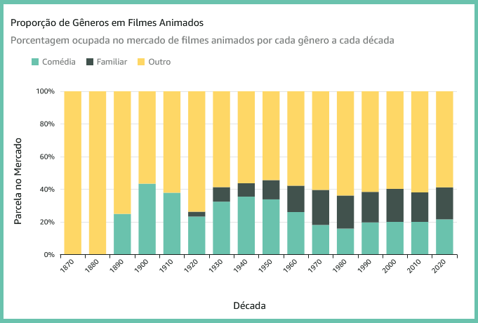
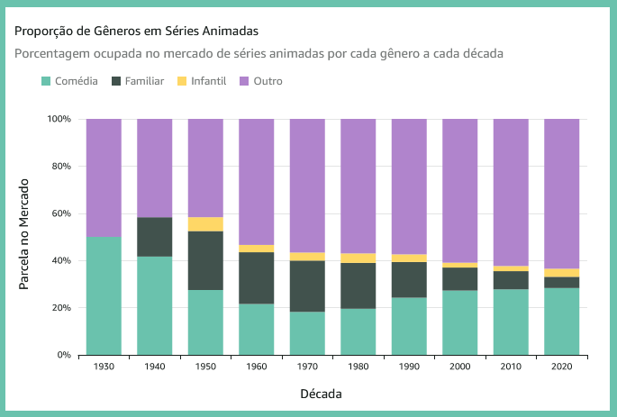

O gráfico ***"Colunas Sobrepostas"***, também conhecido como gráfico de barras empilhadas, é usado para comparar a composição de várias variáveis dentro de uma única categoria. É útil para mostrar as contribuições totais e relativas de diferentes variáveis para um todo. 

No contexto da análise, esses gráficos foram usados para comparar a proporção dos gêneros de filmes e séries produzidos na indústria de animação.

### Mapas de Calor

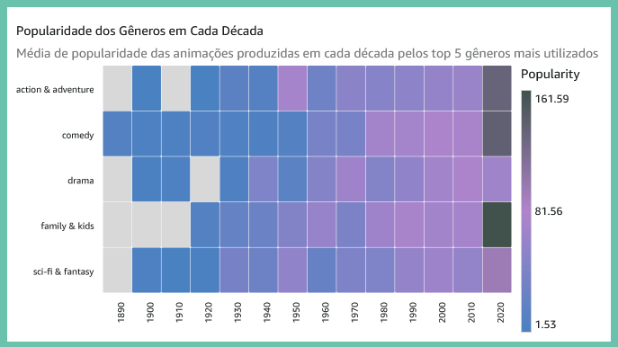

O gráfico ***"Mapas de Calor"*** é usado para visualizar a intensidade ou densidade de dados usando gradientes de cor. É útil para identificar padrões ou correlações em grandes conjuntos de dados. 

No contexto da análise, esses gráficos foram usados para analisar a contagem em relação aos maiores genêros de animação e a popularidade dos mesmos com base em diferentes fatores.