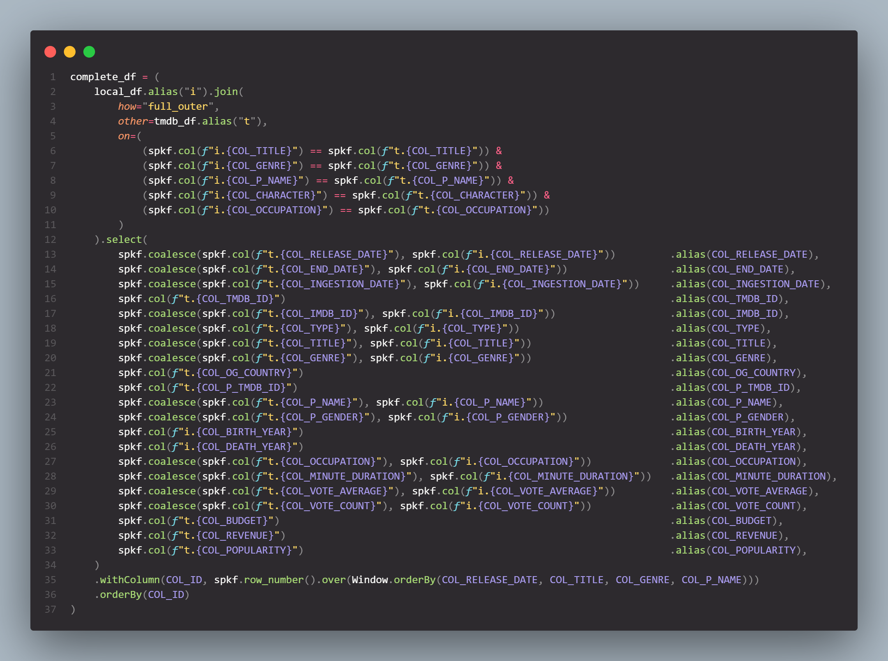
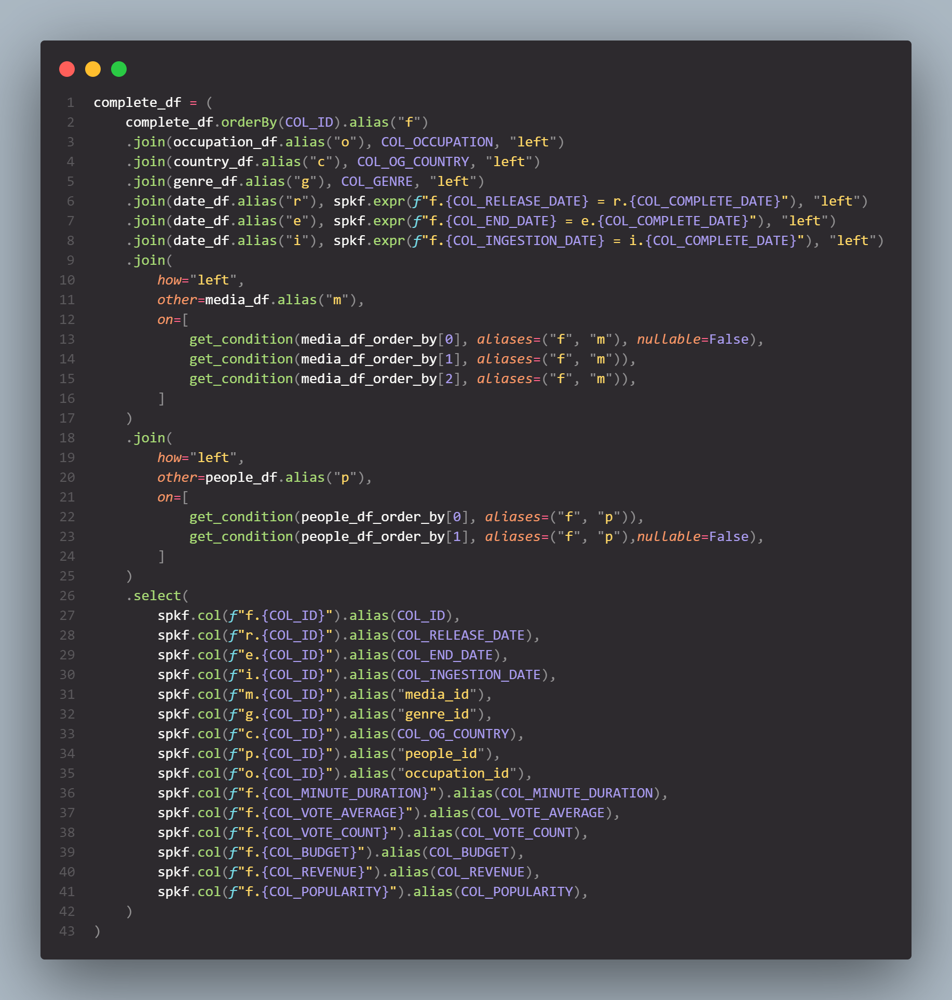
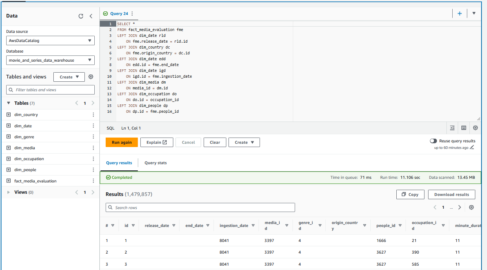

# Desafio

1. [Consumo e Análise dos Dados Refinados](Desafios/)

# Alterações das Atividades Anteriores

## Sprint 09: [modelagem_dimensional.png](../Sprint%209/Desafios/createRefinedDataV2/modelagem_dimensional.png)

O diagrama da modelagem pode ser encontrado em [modelagem_dimensional](../Sprint%209/Desafios/createRefinedDataV2/modelagem_dimensional.png).

### O que mudou?

As alterações realizadas focaram em facilitar a utilização dos dados dentro do QuickSight já que o mesmo não suporta colunas multivaloradas. Foram criadas novas dimensões para gênero, país e ocupação.

## Sprint 09: [createRefinedDataV2.py](../Sprint%209/Desafios/createRefinedDataV2/createRefinedDataV2.py)

Todos os arquivos do novo Glue Job criado podem ser encontrados na pasta [createRefinedDataV2](../Sprint%209/Desafios/createRefinedDataV2/).

### O que mudou?

A alteração se deve ao fato que as dimensões se uniam de forma embaralhada a tabela fato. Foi recriado toda a lógica de criação de dimensões e da tabela fato do zero comportando as novas alterações da modelagem dimensional.
- Query de união dos dados de diferentes fontes

- Select para criar a tabela fato

# Evidências

* Configuração do Dataset para a análise no QuickSight:

* Tabelas geradas a partir de crawlers na camada refined

