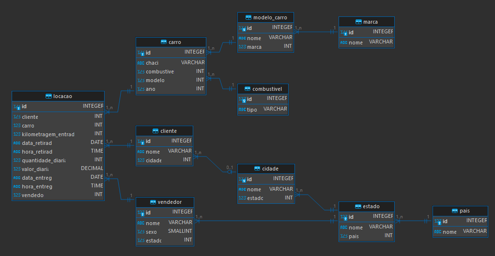
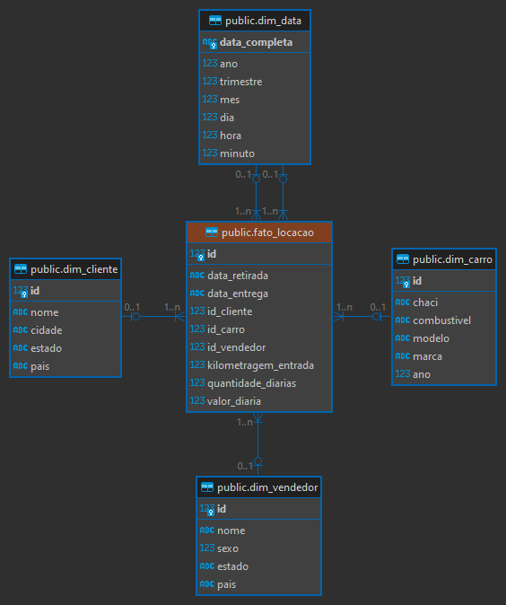

# Etapas

* [Etapa 1 - Normalizar Base de Dados](Etapa-1/criar_modelo_relacional.sql)

* [Etapa 2 - Modelo Dimensional baseado no Modelo Relacional](Etapa-2/criar_modelo_dimensional.sql)

## Modelo Relacional

## Modelo Dimensional

## Banco de Dados Final

# Passo Para Normalização do Banco de Dados

## 1. Primeira Forma Normal

Fazendo uma análise rápida das colunas encontradas em *tb_locacao* podemos notar que todos os campos obedecem a regra de atomicidade e não são multivalorados.

## 2. Segunda Forma Normal

Com *tb_locacao* já estando na FN1 podemos procurar por colunas que não dependem da chave primaria "*id*" e remove-las criando novas tabelas.

* *nomeCliente*, *cidadeCliente*, *estadoCliente* e *paisCliente* dependem de *idCliente* 
* *classiCarro*, *marcaCarro*, *modeloCarro* e *anoCarro* dependem de *idCarro*
* *tipoCombustivel* depende de *idCombustivel*
* *nomeVendedor*, *sexoVendedor* e *estadoVendedor* dependem de *idVendedor*

Podemos colocar *idCombustivel* como dependente de *idCarro* por representar o combustivel que aquele veículo utiliza.

*kmCarro* aparenta depender de *idCarro*, entretanto este campo serve mais como um indicativo da kilometragem do carro no momento de locação, dependendo da própria *tb_locacao*

Colocando tudo na segunda forma devemos ter algo como:

## 3. Terceira Forma Normal

Com *tb_locacao* estando na FN2 podemos verificar se todos os atributos de cada tabela são funcionalmente independentes uns dos outros.

Neste sentido temos dois casos:
1. Dentro de ***cliente*** e ***vendedor*** temos a coluna *estado* que indica o nome do estado em que se encontram, podemos assumir que este estado está diretamente ligado a um país. Também podemos fazer este tipo de análise para o campo *cidade* em ***cliente*** onde assumimos que a cidade depende de um estado.
2. Dentro de ***carro*** temos os campos *marca* e *modelo*, onde, podemos pensar que varios carros podem ter uma marca ou modelo em comum, assim como o modelo de um carro pertence a marca dele.

Colocando tudo na terceira forma devemos ter algo como:

