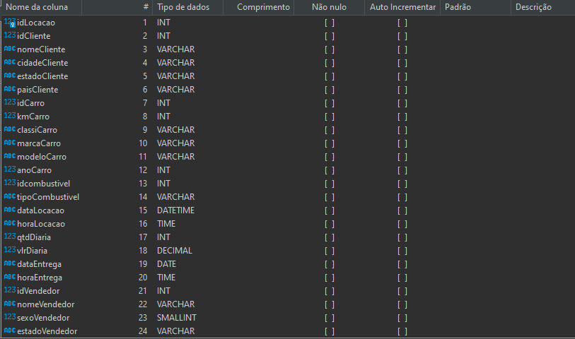
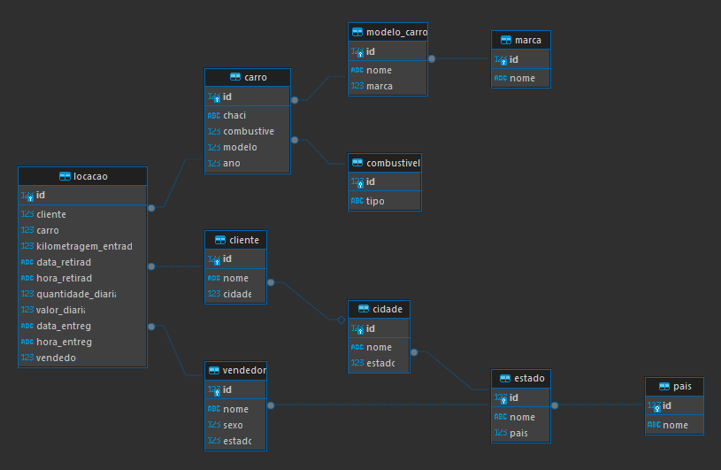
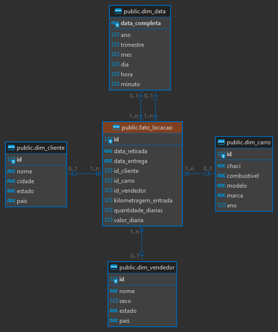
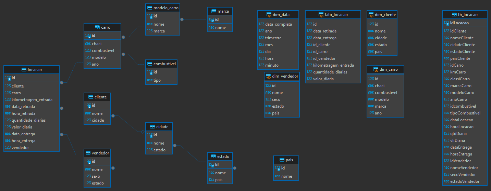
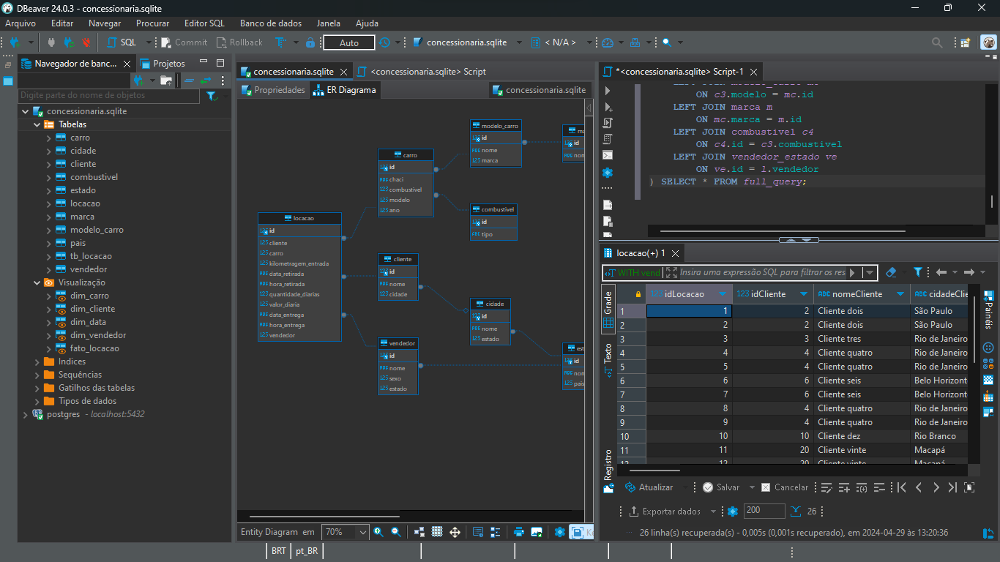

# Desafio

1. [Normalização e Modelagem do Banco de Dados](Desafios/)

# Aprendizado

1. [SQL para análise de dados](Aprendizado/SQL%20para%20análise%20de%20dados.md)

# Exercícios

1. [Seção 3](Exercícios/Seção%203/)

2. [Seção 4](Exercícios/Seção%204/)

3. [Seção 6](Exercícios/Seção%206/)

# Evidências

* Script [criar_modelo_relacional.sql](Desafios/Etapa-1/criar_modelo_relacional.sql) feito para a [etapa 1](Desafios/Etapa-1/) do desafio, serve para criar um banco dados relacional normalizado a partir do banco de dados entregue pelo desafio 

* Script [criar_modelo_dimsensional.sql](Desafios/Etapa-2/criar_modelo_dimensional.sql) feito para a [etapa 2](Desafios/Etapa-2/) do desafio, serve para criar views a partir do banco de dados relacional que serve como um banco de dados dimensional para os mesmos dados

* Propriedades das colunas de *tb_locacao* no desafio apresentadas pelo dbeaver

* Diagram relacional do banco de dados do desafio na segunda forma normal

* Diagrama relacional do banco de dados do desafio na terceira forma normal

* Diagrama relacional do modelo dimensional do banco de dados do desafio gerado a partir do import das views criadas na [etapa 2](Desafios/Etapa-2/) em um banco de dados PostgreSQL

* Diagrama relacional do banco de dados SQLite completo após desafio

* Print do projeto finalizado no SGBD Dbeaver

# Certificados

- Certificado do Curso SQL para Análise de Dados: Do básico ao avançado

