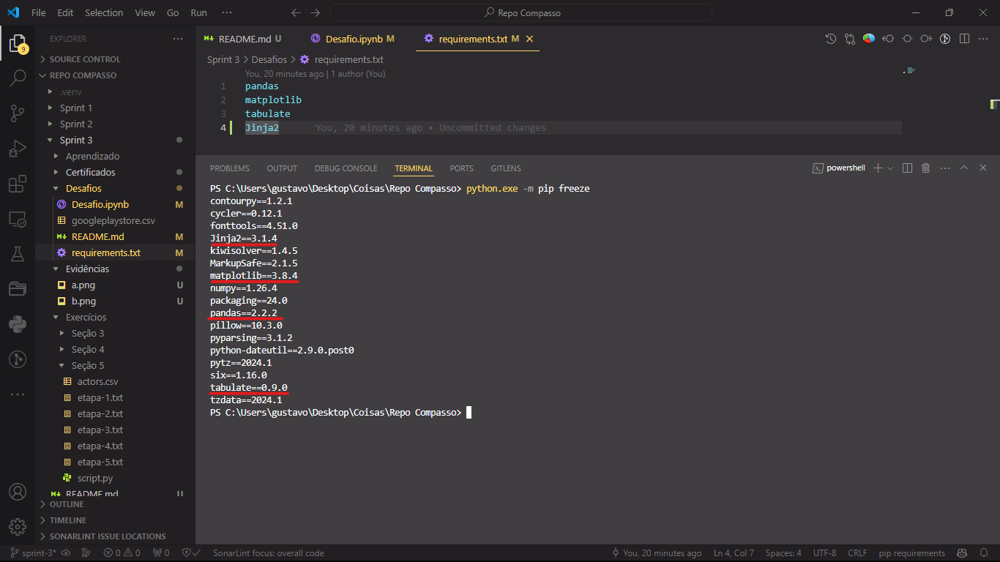

# Desafio

1. [Processamento e Geração de Gráficos de Análise](Desafios/)

# Aprendizado

1. [Anotações Curso Python](Aprendizado/Python%203%20-%20Curso%20Completo%20Básico%20ao%20Avançado.md)

2. [Exercícios Curso Python](Aprendizado/Desafios%20Curso%20Python%203.ipynb)

# Exercícios

1. [Seção 3](Exercícios/Seção%203/)

2. [Seção 4](Exercícios/Seção%204/)

3. [Seção 5](Exercícios/Seção%205/)

# Evidências

* Bibliotecas instaladas no ambiente virtual para o desafio.

# Certificados

- Certificado do Curso AWS Partner: Cloud Economics (Portuguese Brazil) - [Versão PDF](Certificados/Parceiro%20da%20AWS%20-%20Aspectos%20econômicos%20da%20nuvem.pdf)

