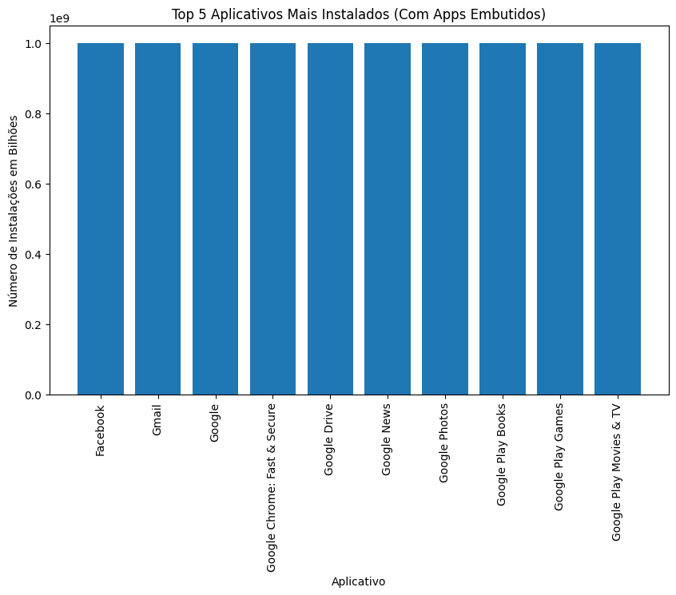
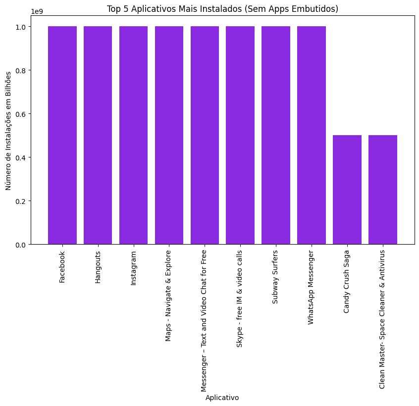
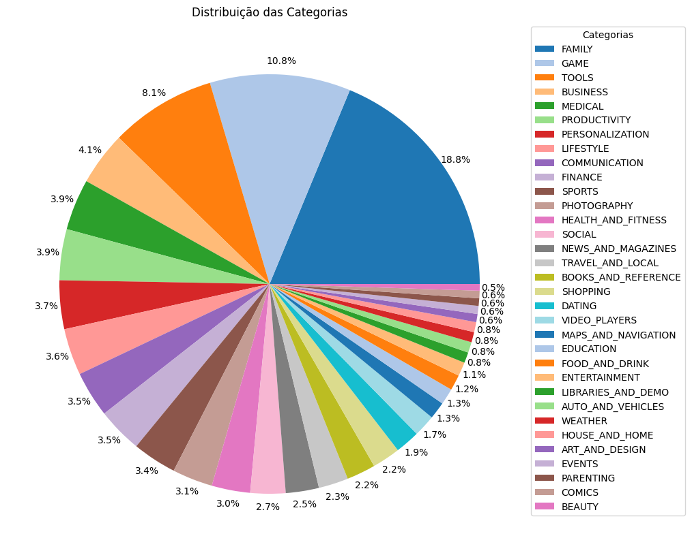
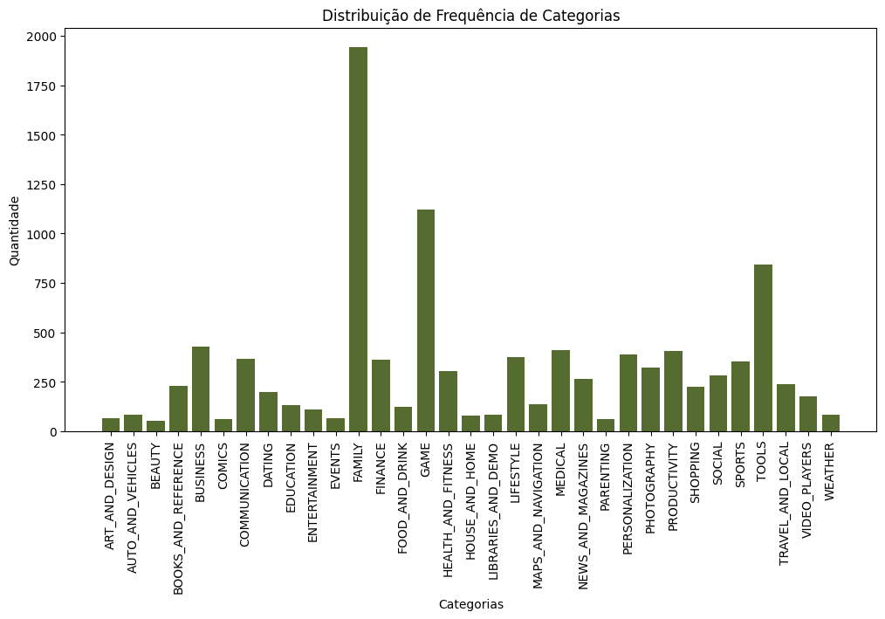
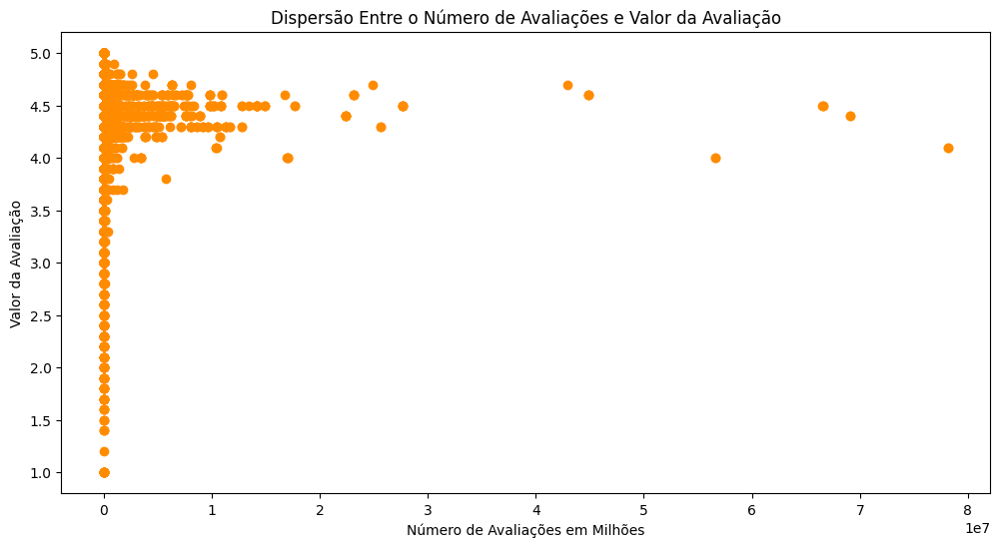
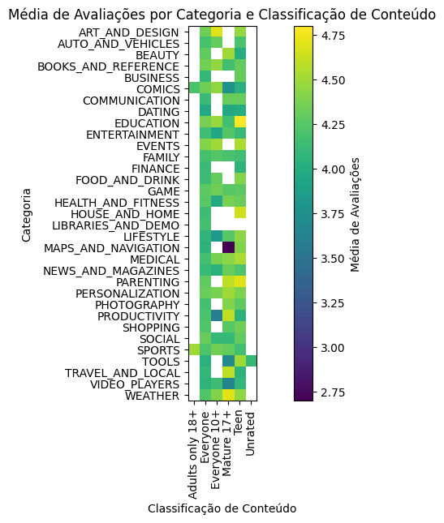

# Desafio

1. [Processamento e Geração de Gráficos de Análise](Desafios/)

# Aprendizado

1. [Anotações Curso Python](Aprendizado/Python%203%20-%20Curso%20Completo%20Básico%20ao%20Avançado.md)

2. [Exercícios Curso Python](Aprendizado/Desafios%20Curso%20Python%203.ipynb)

# Exercícios

1. [Seção 3](Exercícios/Seção%203/)

2. [Seção 4](Exercícios/Seção%204/)

3. [Seção 5](Exercícios/Seção%205/)

# Evidências

* Bibliotecas instaladas no ambiente virtual para o desafio.

* Arquivo listando bibliotecas necessárias para desafio.

* Jupyter Notebook com os resultados adquiridos na minha máquina.

* Output do tratamento de registros duplicados na Etapa 2: Parte 1.

* Gráficos de barra gerados durante a Etapa 2: Parte 2.

* Gráfico de pizza gerado durante a Etapa 2: Parte 3.

* Gráfico de barras adicional gerado durante a Etapa 2: Parte 3.

* Output do cálculo do App mais caro do dataset da Etapa 2: Parte 4.

* Output do cálculo do número de Apps classificados como "Mature 17+" da Etapa 2: Parte 5.

* Output do cálculo dos 10 Apps mais avaliados da Etapa 2: Parte 6.

* Output do cálculo dos 10 gêneros de aplicativos mais baixados da Etapa 2: Parte 7. 

* Output do cálculo da classificação de conteúdo mais avaliada da Etapa 2: Parte 7.

* Gráfico de disperção gerado durante a Etapa 2: Parte 8.

* Mapa de calor gerado durante a Etapa 2: Parte 8.

# Certificados

- Certificado do Curso AWS Partner: Cloud Economics (Portuguese Brazil) - [Versão PDF](Certificados/Parceiro%20da%20AWS%20-%20Aspectos%20econômicos%20da%20nuvem.pdf)

