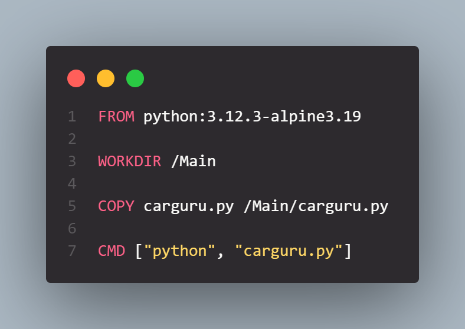
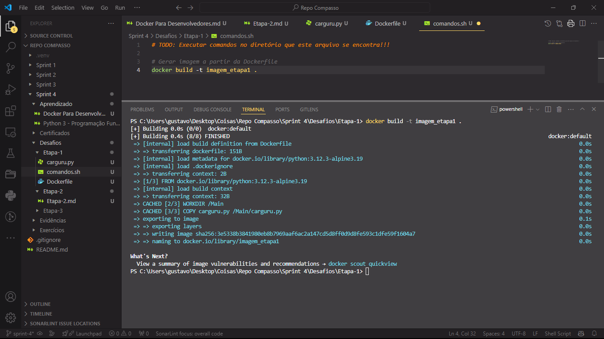
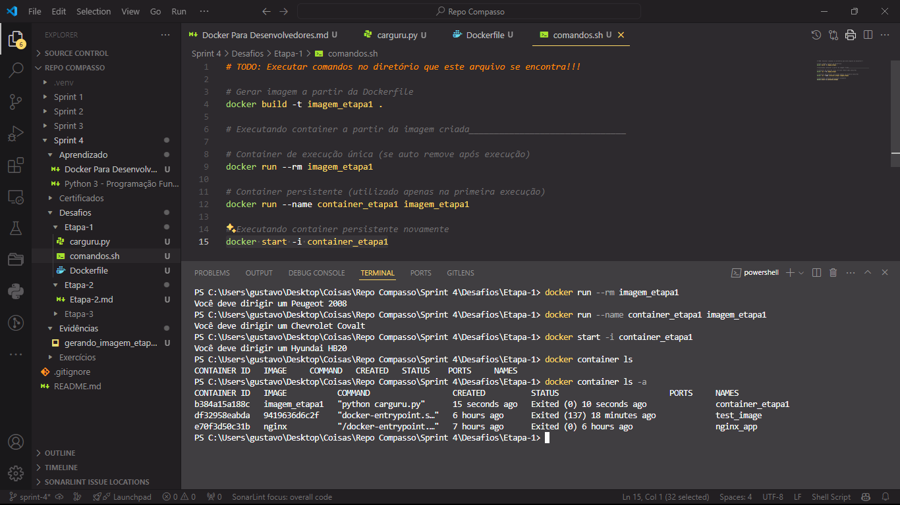
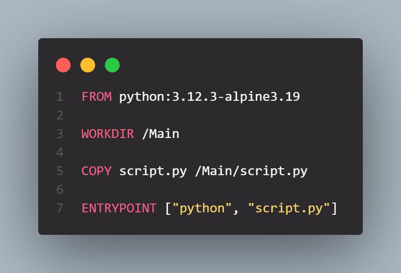
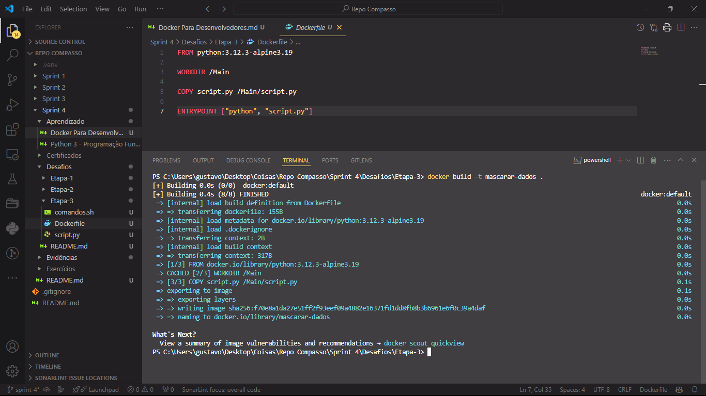

# Desafio

1. [Criação e Manipulação de Containeres](Desafios/)

# Aprendizado

1. [Anotações Python - Programação Funcional](Aprendizado/Python%203%20-%20Programação%20Funcional.md)

2. [Anotações Docker Para Desenvolvedores](Aprendizado/Docker%20Para%20Desenvolvedores.md)

# Exercícios

1. [Seção Única](Exercícios/)

# Evidências

* Script [carguru.py](Desafios/Etapa-1/carguru.py) utilizado para a [etapa 1](Desafios/Etapa-1/) do desafio, ele retorna uma string indicando um modelo aleátorio de carro.


* Arquivo [Dockerfile](Desafios/Etapa-1/Dockerfile) feito para a [etapa 1](Desafios/Etapa-1/) do desafio, serve para criar uma imagem docker com o ambiente necessario para rodar o script descrito acima.



* Arquivo [comandos.sh](Desafios/Etapa-1/comandos.sh) feito para a [etapa 1](Desafios/Etapa-1/) do desafio, serve para descrever comandos utilizados no terminal para criar e rodar imagem/container pedidos na etapa.


* Geração da imagem docker ```imagem_etapa1``` utilizada na [etapa 1](Desafios/Etapa-1/) do desafio.



* Criação e execução dos containeres criados a partir da imagem docker descrita no item anterior.



* Arquivo markdown [Etapa-2.md](Desafios/Etapa-2/Etapa-2.md) criado para a [Etapa 2](Desafios/Etapa-2/) do desafio, serve para responder a questão levantada nesta mesma etapa.

> 

* Script [script.py](Desafios/Etapa-3/script.py) utilizado para a [etapa 3](Desafios/Etapa-3/) do desafio, ele recebe argumentos para ser executado e retorna um o conteúdo de cada argumento como um hash SHA-1.


* Arquivo [Dockerfile](Desafios/Etapa-3/Dockerfile) feito para a [etapa 3](Desafios/Etapa-3/) do desafio, serve para criar uma imagem docker com o ambiente necessario para rodar o script descrito acima.



* Arquivo [comandos.sh](Desafios/Etapa-3/comandos.sh) feito para a [etapa 3](Desafios/Etapa-3/) do desafio, serve para descrever comandos utilizados no terminal para criar e rodar imagem/container pedidos na etapa.


* Geração da imagem docker ```mascarar-dados``` utilizada na [etapa 3](Desafios/Etapa-3/) do desafio.



* Criação e execução dos containeres criados a partir da imagem docker descrita no item anterior.


# Certificados

- Certificado do Curso AWS Partner Accreditation (Bussiness) - [Versão PDF]()


