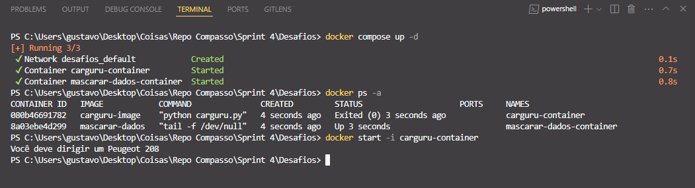
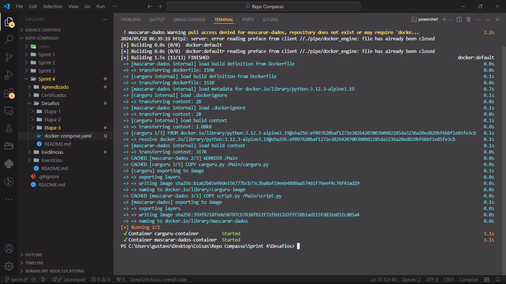
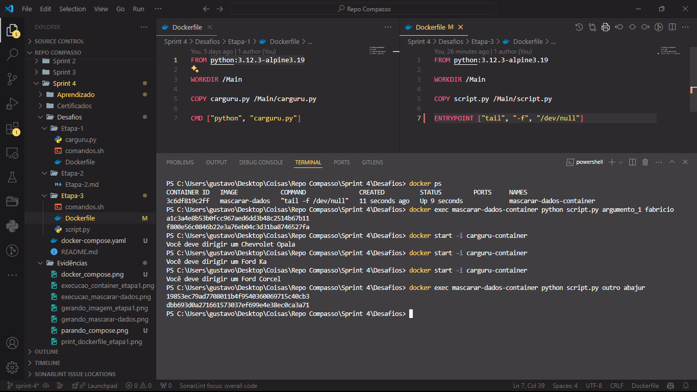
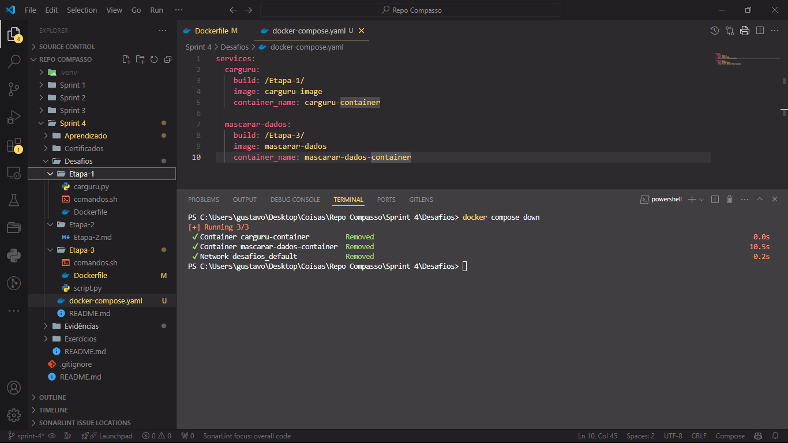

# Desafio

1. [Criação e Manipulação de Containeres](Desafios/)

# Aprendizado

1. [Anotações Python - Programação Funcional](Aprendizado/Python%203%20-%20Programação%20Funcional.md)

2. [Anotações Docker Para Desenvolvedores](Aprendizado/Docker%20Para%20Desenvolvedores.md)

# Exercícios

1. [Seção Única](Exercícios/)

# Evidências

* Script [carguru.py](Desafios/Etapa-1/carguru.py) utilizado para a [etapa 1](Desafios/Etapa-1/) do desafio, ele retorna uma string indicando um modelo aleátorio de carro.


* Arquivo [Dockerfile](Desafios/Etapa-1/Dockerfile) feito para a [etapa 1](Desafios/Etapa-1/) do desafio, serve para criar uma imagem docker com o ambiente necessario para rodar o script descrito acima.

```Dockerfile
FROM python:3.12.3-alpine3.19

WORKDIR /Main

COPY carguru.py /Main/carguru.py

CMD ["python", "carguru.py"]
```

* Arquivo markdown [Etapa-2.md](Desafios/Etapa-2/Etapa-2.md) criado para a [Etapa 2](Desafios/Etapa-2/) do desafio, serve para responder a questão levantada nesta mesma etapa.

> [Etapa-2.md](Desafios/Etapa-2/Etapa-2.md)

* Exemplo de persistencia de container utilizado para a [Etapa-2.md](Desafios/Etapa-2/Etapa-2.md) do desafio.



* Script [script.py](Desafios/Etapa-3/script.py) utilizado para a [etapa 3](Desafios/Etapa-3/) do desafio, ele recebe argumentos para ser executado e retorna um o conteúdo de cada argumento como um hash SHA-1.


* Arquivo [Dockerfile](Desafios/Etapa-3/Dockerfile) feito para a [etapa 3](Desafios/Etapa-3/) do desafio, serve para criar uma imagem docker com o ambiente necessario para rodar o script descrito acima.

```Dockerfile
FROM python:3.12.3-alpine3.19

WORKDIR /Main

COPY script.py /Main/script.py

ENTRYPOINT ["tail", "-f", "/dev/null"]
```

* Arquivo [docker-compose.yaml](./Desafios/docker-compose.yaml), serve para configurar a criação de todos os container utilizados no desafio.

```yaml
services:
  carguru:
    build: /Etapa-1/
    image: carguru-image
    container_name: carguru-container
  
  mascarar-dados:
    build: /Etapa-3/
    image: mascarar-dados
    container_name: mascarar-dados-container
```

* Arquivo [comandos.sh](Desafios/comandos.sh), serve para descrever comandos utilizados no terminal para criar e rodar imagem/container pedidos em cada etapa.


* Contruindo imagens e criando containeres para o desafio com o docker compose.



* Imagens e containeres criados pelo docker compose.


* Utilizando os containeres criados para rodar [carguru.py](Desafios/Etapa-1/carguru.py) e [script.py](Desafios/Etapa-3/script.py).



* Encerrando a utilização do docker compose.



# Certificados

- Docker para desenvolvedores - [Versão PDF](Certificados/Docker%20para%20desenvolvedores.pdf)


- AWS Technical Essentials - [Versão PDF](Certificados/AWS%20Technical%20Essentials.pdf)


- AWS Partner: Credenciamento Técnico - [Versão PDF](Certificados/AWS%20Partner%20-%20Credenciamento%20técnico.pdf)


