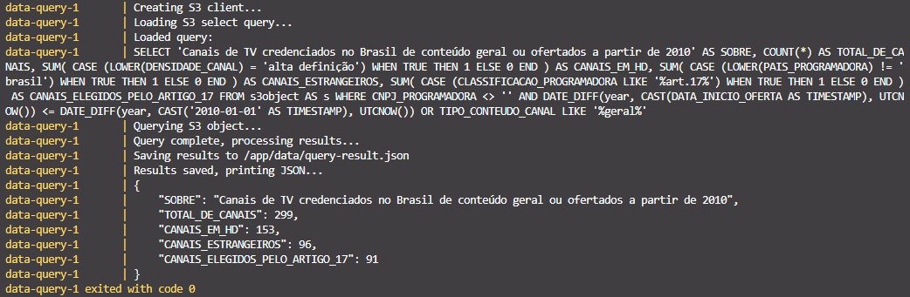

# Etapas

---

## Processamento dos dados:

* Script python utilizado: [data_processing.py](data-processing/data_processing.py)
* Dockerfile criada para executar script: [Dockerfile](data-processing/Dockerfile)

## Upload dos dados:

* Script python utilizado: [data_upload.py](data-upload/data_upload.py)
* Dockerfile criada para executar script: [Dockerfile](data-upload/data_upload.py)

## Processamento dos dados:

* Script python utilizado: [data_query.py.py](data-query/data_query.py)
* Script SQL utilizado: [s3select_query.sql](data-query/s3select_query.sql)
* Dockerfile criada para executar script: [Dockerfile](data-query/Dockerfile)

---

# Passos para reexecução do desafio

Antes de tudo devemos garantir que estamos acessando a pasta de Desafio desta sprint.

```bash
cd "<path_repositorio>/Sprint 5/Desafios/"
```

Na pasta [data](data/) é necessário inserir os dados necessários para o acesso a AWS no arquivo [aws_parameters.env](data/aws_parameters.env)

```bash
aws_access_key_id= # Chave de acesso AWS
aws_secret_access_key= # Chave de acesso secreta AWS
aws_session_token= # Token da sessão utilizada
aws_region= # Região utilizada
aws_bucket= # Nome do bucket que será acessado
aws_bucket_object= # Nome do objeto a ser acessado no bucket
```
Basta agora apenas utilizar o docker compose para gerar as imagens e containeres que serão utilizadas neste desafio.

```bash
docker compose up
```

Devemos ter o seguinte output ao listar as imagens e containeres criados:

1. Irá aparecer o log de criação dos containeres


2. Os dados de [canais-de-programacao-de-programadoras-ativos-credenciados.json](data/canais-de-programacao-de-programadoras-ativos-credenciados.json) serão processado e salvos como CSV em [canais-credenciados.csv](data/canais-credenciados.csv)


3. Será criado uma sessão com o s3 da amazon e será verificado a existencia/acesso dos bucket e objeto descritos em [aws_parameters.env](data/aws_parameters.env)


4. Será criado outra sessão com o s3 encarregada de fazer uma query S3Select no objeto descrito em [aws_parameters.env](data/aws_parameters.env), por fim o resultado sera mostrado e salvo em [query-result.json](data/query-result.json)


Podemos excluir os containeres criados após a execução completa deles com o comando:
```bash
docker compose down
```