# Desafio

1. [Consultando buckets AWS com S3Select e Boto3](Desafios/)

# Evidências

* Arquivo JSON [canais-de-programacao-de-programadoras-ativos-credenciados.json](Desafios/data/canais-de-programacao-de-programadoras-ativos-credenciados.json) retirado da base de dados pública do governo utilizado para o desafio

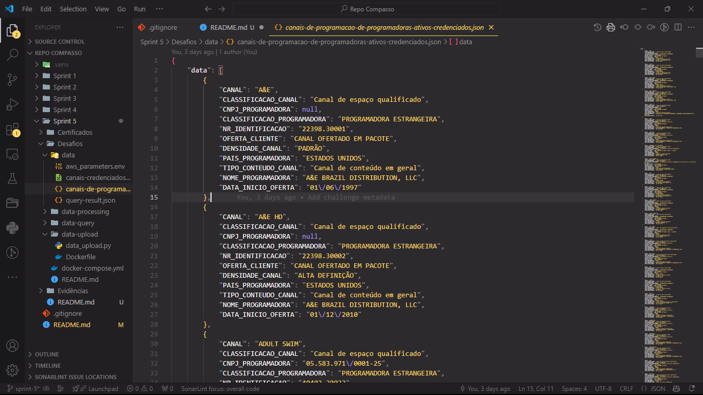

* Arquivo CSV [canais-credenciados.csv](Desafios/data/canais-credenciados.csv), arquivo resultante do processamento dos dados em [data_processing.py](Desafios/data-processing/data_processing.py).

* Arquivo ENV [aws_parameters.env](Desafios/data/aws_parameters.env) que contêm variáveis importantes para o acesso da AWS. Utilizado por [data_upload.py](Desafios/data-upload/data_upload.py) e [data_query.py](Desafios/data-query/data_query.py)

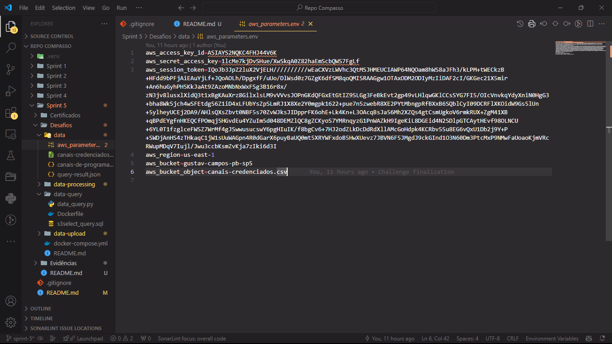

* Arquivo JSON [query-result.json](Desafios/data/query-result.json), arquivo gerado a partir do resultado da consulta realizada em [data_query.py](Desafios/data-query/data_query.py).

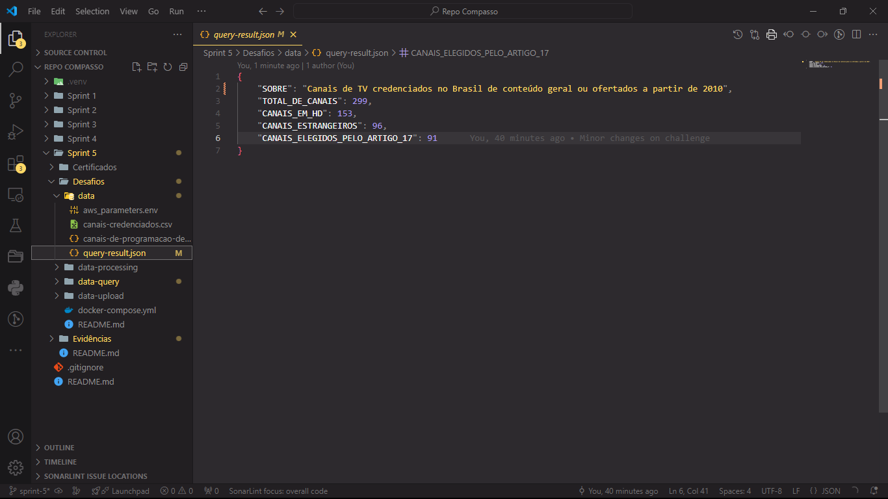

* Script [data_processing.py](Desafios/data-processing/data_processing.py) utilizado para o desafio, ele processa e normaliza os dados do JSON referenciado acima e cria um CSV com os dados processados.

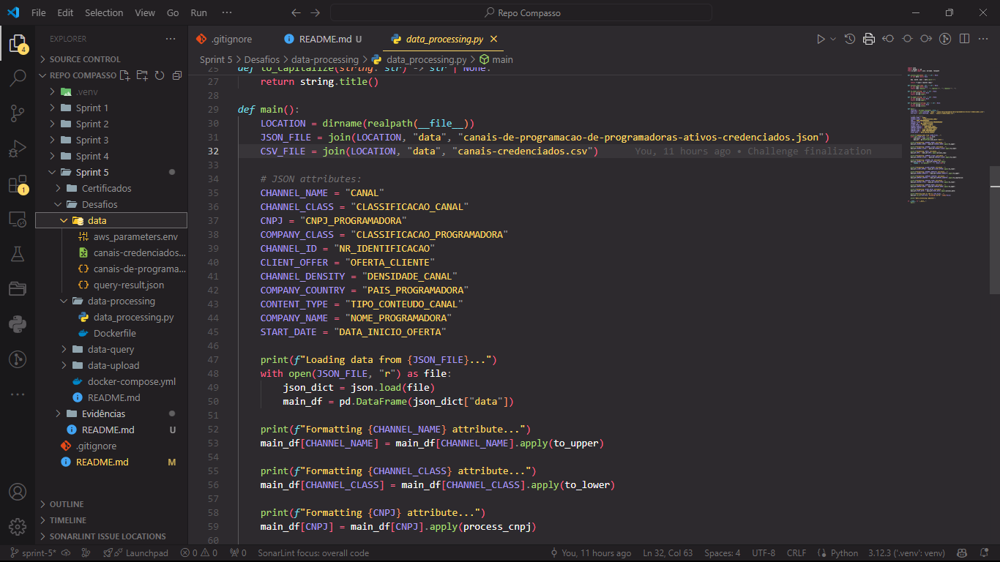

* Arquivo [Dockerfile](Desafios/data-processing/Dockerfile) em [data-processing](Desafios/data-processing/), serve para criar uma imagem docker com o ambiente necessario para rodar o script descrito acima.

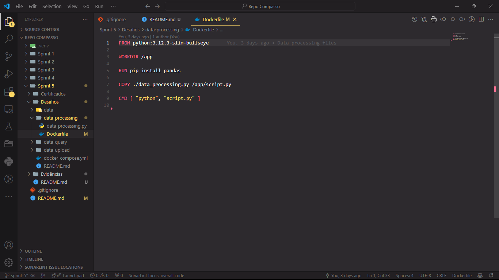

* Script [data_upload.py](Desafios/data-upload/data_upload.py) utilizado para o desafio, ele utiliza utiliza os paramêtros de [aws_parameters.env](Desafios/data/aws_parameters.env) para acessar a AWS. Ele também verifica se [canais-credenciados.csv](Desafios/data/canais-credenciados.csv) já foi enviado para nuvem ou faz o seu upload em caso negativo.

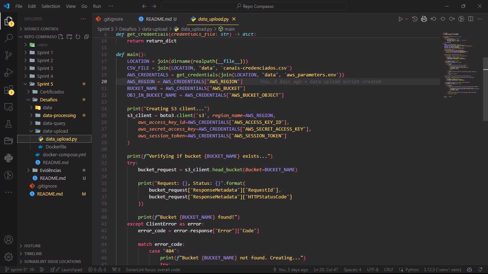

* Arquivo [Dockerfile](Desafios/data-upload/Dockerfile) em [data-upload](Desafios/data-upload/), serve para criar uma imagem docker com o ambiente necessario para rodar o script descrito acima.

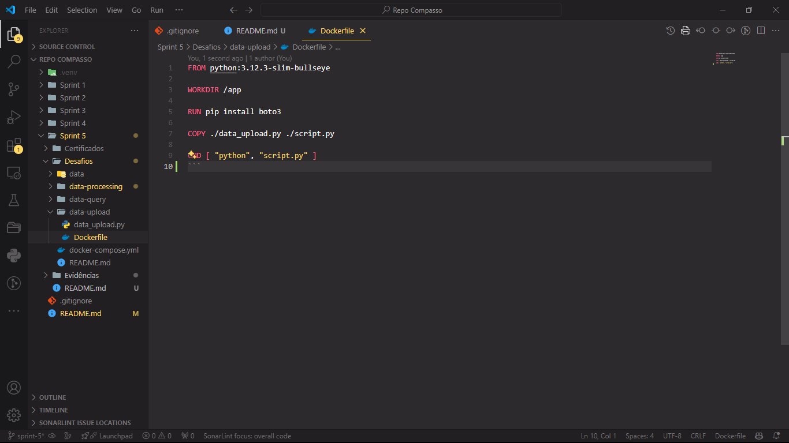

* Script [data_query.py](Desafios/data-query/data_query.py) utilizado para o desafio, ele utiliza utiliza os paramêtros de [aws_parameters.env](Desafios/data/aws_parameters.env) para acessar a AWS. Ele também utiliza o script SQL [s3select_query.sql](Desafios/data-query/s3select_query.sql) para buscar os dados na AWS.

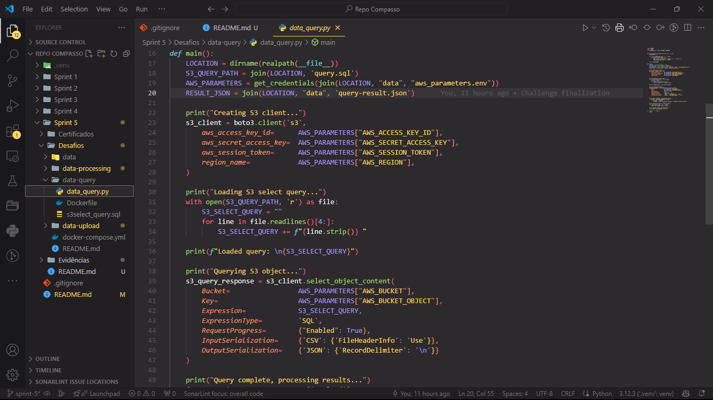

* Arquivo [Dockerfile](Desafios/data-query/Dockerfile) em [data-query](Desafios/data-query/), serve para criar uma imagem docker com o ambiente necessario para rodar o script descrito acima.

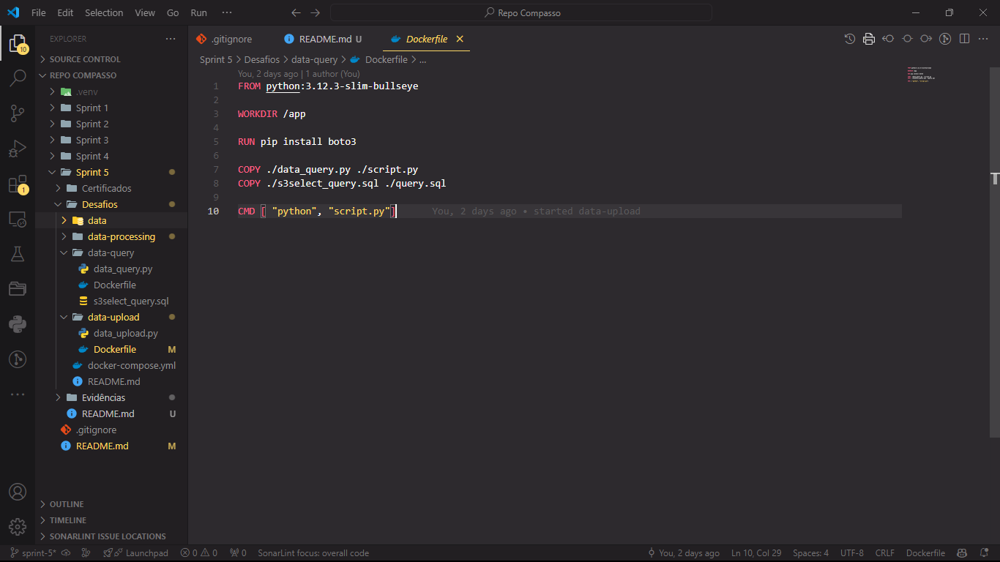

* Script [s3select_query.sql](Desafios/data-query/s3select_query.sql) com uma query S3Select utilizada por [data_query.py](Desafios/data-query/data_query.py).

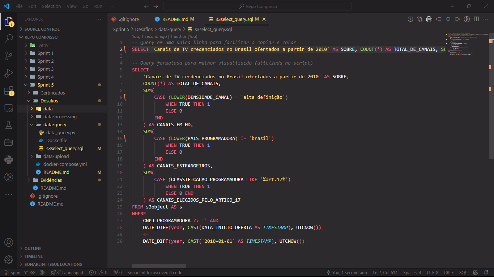

* Arquivo [docker-compose.yml](Desafios/docker-compose.yml) utilizado configurar a criação e execução dos containeres utilizados no desafio.

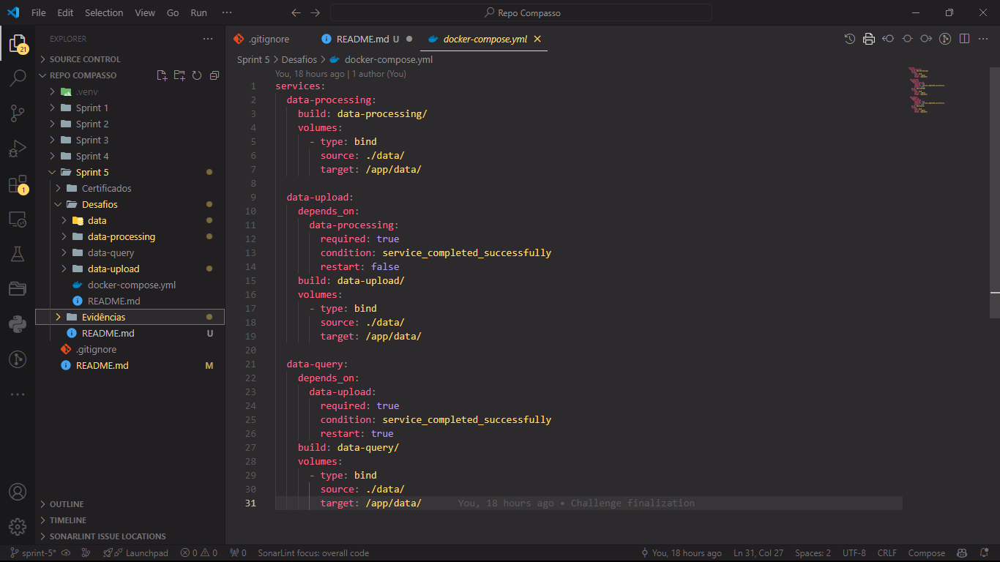

* Log da criação dos conteineres criados para rodar os scripts descritos acima utilizando o [docker-compose.yml](Desafios/docker-compose.yml).

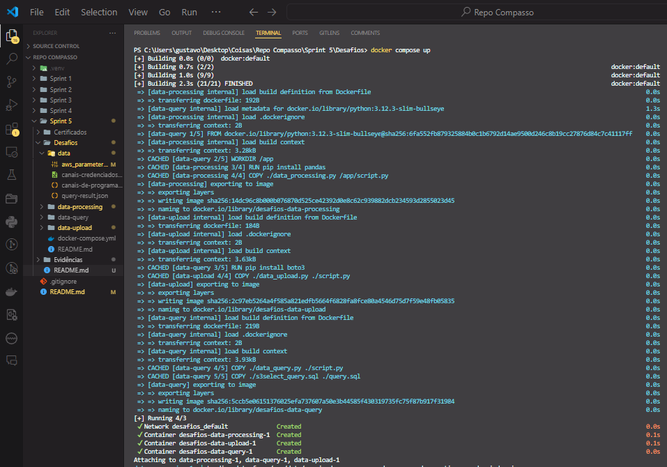

* Log da execução do conteiner criado para rodar o script [data_processing.py](Desafios/data-processing/data_processing.py).

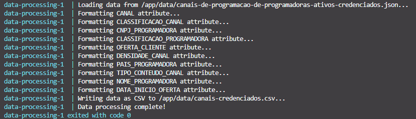

* Log da execução do conteiner criado para rodar o script [data_upload.py](Desafios/data-upload/data_upload.py).

Log com bucket já criado e upload do arquivo já feito.
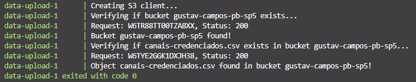

Log com bucket não criado e arquivo não enviado.
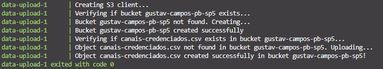

* Log da execução do conteiner criado para rodar o script [data_query.py](Desafios/data-query/data_query.py).

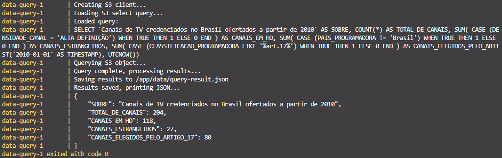

# Certificados

- Badge Cloud Quest: Cloud Practioner

- Certificado AWS Certified Cloud Practioner - [Versão PDF](Certificados/AWS%20Certified%20Cloud%20Practioner.pdf)

