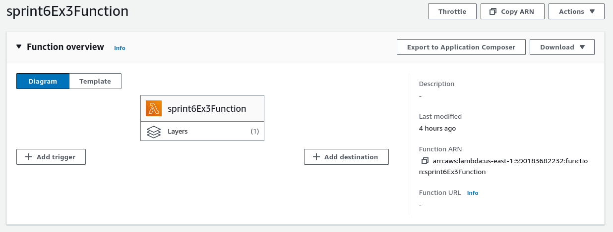

# Exercícios Sprint 6

1. [Utilzar um Bucket como site estático.](Ex1/)

2. [Consultando dados com AWS Athena.](Ex2/)

3. [Criando funções AWS Lambda.](Ex3/)

# Evidências dos exercícios

* Diretório Raiz do bucket criado para os exercícios após a realização de todos os exercícios.

* Pasta data do bucket criado para os exercícios contendo o CSV utilizado no exercício 2.

* Pasta data do bucket criado para os exercícios contendo o CSV utilizado no exercício 2.

* Site estático configurado no bucket no exercício 1 em funcionamento.

* Download do arquivo CSV pelo site estático criado no bucket no exercício 1 em funcionamento.

* Query realizada no AWS Athena para o exercício 2.

* Resultado da query descrita acima para o exercício 2.

* Diretório dentro do bucket utilizado para armazenar a layer criada para o AWS Lambda no exercício 3.

* Função AWS Lambda criada para o exercício 3.

* Log de Execução da Função AWS Lambda criada para o exercício 3.

