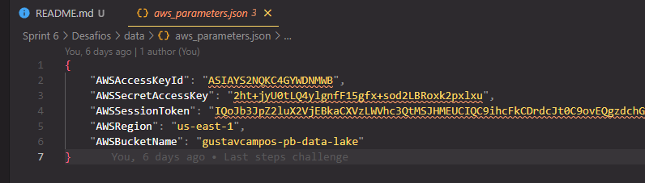
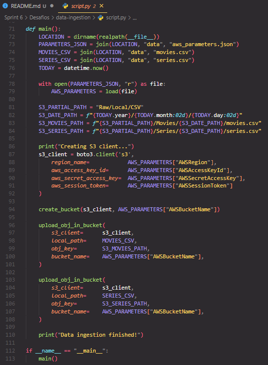
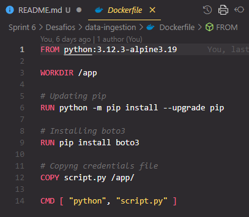
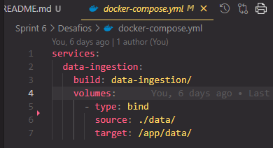
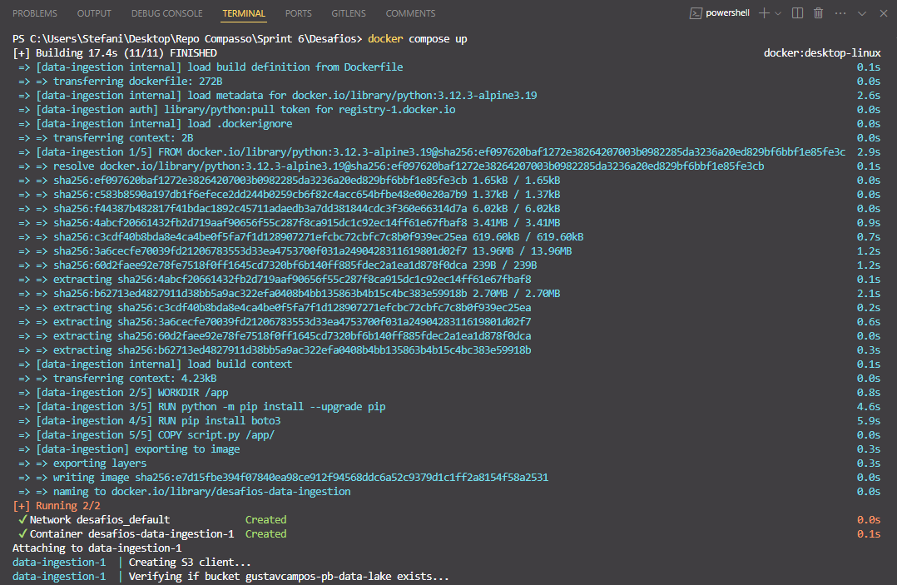
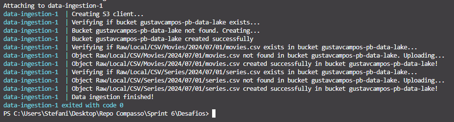
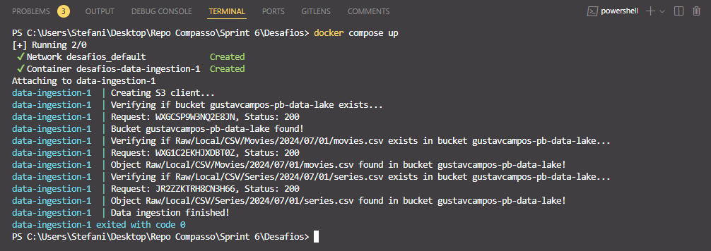

# Desafio

1. [Ingerindo arquivos CSVs locais a um data lake usando Boto3](Desafios/)

# Exercícios

1. [Arquivo Markdown para os Exercícios](Exercícios/)

# Evidências

* Arquivo JSON [aws_parameters.json](Desafios/data/aws_parameters.json) que contêm variáveis importantes para o acesso da AWS. Utilizado por [script.py](Desafios/data-ingestion/script.py)

* Script [script.py](Desafios/data-ingestion/script.py) utilizado para o desafio, ele utiliza os paramêtros de [aws_parameters.json](Desafios/data/aws_parameters.json) para acessar a AWS. Ele também verifica se os arquivos CSV de séries e filmes já foi enviados para nuvem ou faz o seu upload em caso negativo.

* Arquivo [Dockerfile](Desafios/data-ingestion/Dockerfile) em [data-ingestion](Desafios/data-ingestion/), serve para criar uma imagem docker com o ambiente necessario para rodar o script descrito acima.

* Arquivo [docker-compose.yml](Desafios/docker-compose.yml) utilizado configurar a criação e execução do container utilizado no desafio.

* Log do build da imagem docker pelo docker compose [docker-compose.yml](Desafios/docker-compose.yml).

* Log da execução do docker compose [docker-compose.yml](Desafios/docker-compose.yml) sem o bucket de data lake estar criado.

* Log da execução do docker compose [docker-compose.yml](Desafios/docker-compose.yml) com o bucket de data lake criado e todos os arquivos já inseridos.

# Certificados

- Certificado AWS Fundamentals of Analytics - Part 1 - [Versão PDF](Certificados/Fundamentals%20of%20Analytics%20-%20Part%201.pdf)

- Certificado AWS Fundamentals of Analytics - Part 2 - [Versão PDF](Certificados/Fundamentals%20of%20Analytics%20-%20Part%202.pdf)

- Certificado AWS Serverless Analytics - [Versão PDF](Certificados/Serverless%20Analytics.pdf)

- Certificado AWS Introduction to Amazon Athena - [Versão PDF](Certificados/Introduction%20to%20Amazon%20Athena.pdf)

- Certificado AWS Glue Getting Started - [Versão PDF](Certificados/AWS%20Glue%20Getting%20Started.pdf)

- Certificado Amazon EMR Getting Started - [Versão PDF](Certificados/Amazon%20EMR%20Getting%20Started.pdf)

- Certificado Amazon Redshift Getting Started - [Versão PDF](Certificados/Amazon%20Redshift%20Getting%20Started.pdf)

- Certificado Best Practices for Data Warehousing with Amazon Redshift - [Versão PDF](Certificados/Best%20Practices%20for%20Data%20Warehousing%20with%20Amazon%20Redshift.pdf)

- Certificado Amazon QuickSight - Getting Started - [Versão PDF](Certificados/Amazon%20QuickSight%20-%20Getting%20Started.pdf)

