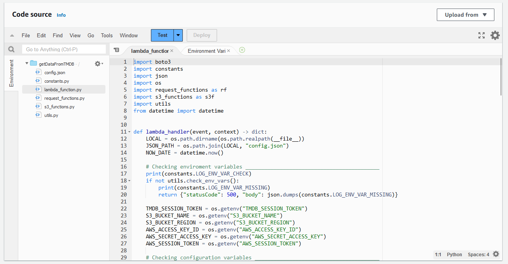
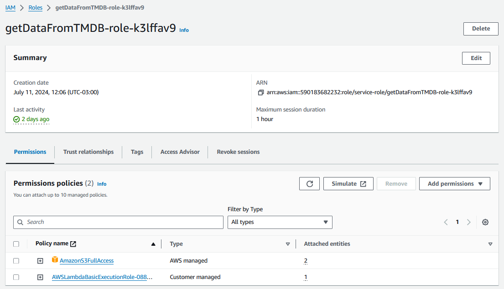
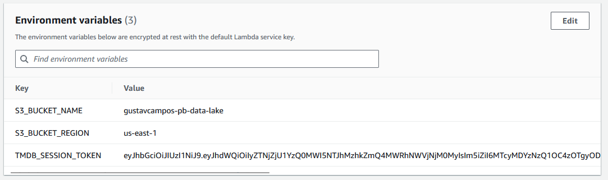
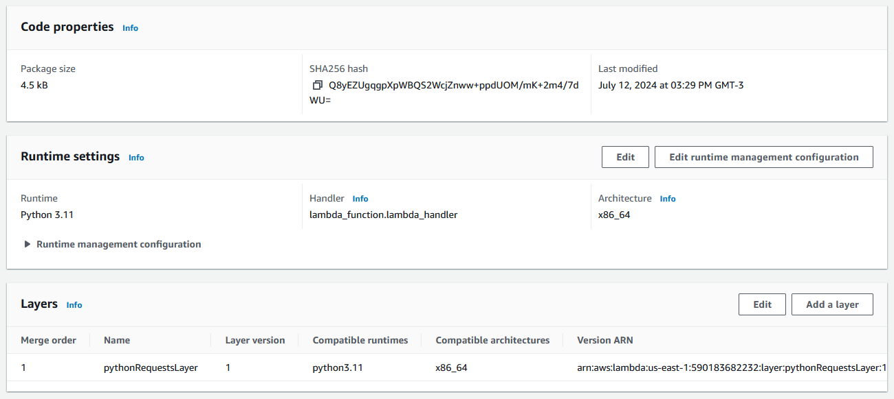
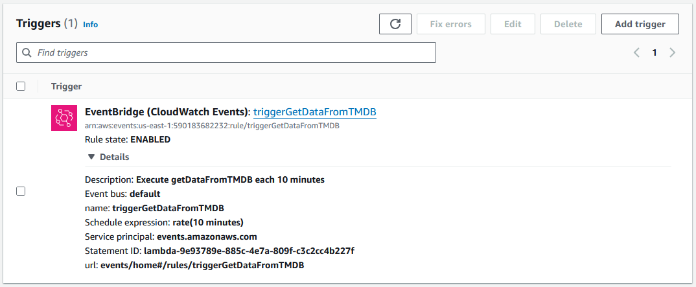

# Etapas

---

## Contextualização do Desafio Final:

* Como a Squad 1 deve abordar filmes/séries de comédia ou animação, tenho como idéia inicial verificar se o gênero de animação possuía algum tipo de estigma e caso verdadeiro, como ele evoluiu ao longo do tempo.
* Pretendo verificar quais genêros que mais aparecem em conjunto com animação em cada década e verificar se os filmes mais populares dos atores/dubladores que aparecem nestes filmes são animações.

## Ingestão de Dados:

* Script principal: [lambda_function.py](Local/lambda_function.py)
* Arquivo de configuração: [config.json](Local/config.json)
* Script de definição de constantes: [constants.py](Local/constants.py)
* Script de funções utilitárias: [utils.py](Local/utils.py)
* Script de funções para requisição da API: [request_functions.py](Local/request_functions.py)
* Script de funções para o S3: [s3_functions.py](Local/s3_functions.py)
* Script para teste local: [local_test.py](Local/local_test.py)
---

# Passos para reexecução do desafio

## Criando Função Lambda

Dentro do console da AWS devemos fazer os seguintes passos:

* Acesse página de funções do AWS Lambda;
* Selecione criar função:
    * Escolha a opção **"author from scratch"**;
    * Coloque o nome da função como **getDataFromTMDB**;
    * Escolha **Python 3.11** como runtime;
    * Vá ao final da página e selecione criar função.
* Após a criação da função você devera ser redirecionado para a página da mesma, caso contrário acesse a função criada;
* Desça até a seção de código fonte (**code source**);
* Envie os arquivos de [lambda.zip](lambda.zip) na opção da parte superior direita (**Upload From**);
* Ao final você deverá ter um ambiente dev parecido com o seguinte:

## Configurando Variáveis, Permissões e Camadas

### Configurando acesso ao S3
* Na aba de configuração da função Lambda, acesse a aba de permissões;
* Acesse o link descrito em **"Role name"**;
* Na página do cargo criado para o função Lambda, desça até a sessão de permissões.
* Selecione **"Attach Policies"** no drop-down de adicionar permissões;
* Selecione a permissão **AmazonS3FullAccess**;
* Desça ao final da página e adicione a permissão;
* Ao final a página de visão geral do cargo criado devera parecer com isso:
 

### Configurando variáveis
* Na aba de configuração da função Lambda, acesse a aba de variáveis de ambiente;
* No canto direito superior selecione para editar;
* Adicione as seguintes variáveis:
    * **S3_BUCKET_NAME**: Nome do bucket que deseja utilizar como data lake.
    * **S3_BUCKET_REGION**: Região do bucket utilizado, geralmente *"us-east-1"*.
    * **TMDB_SESSION_TOKEN**: Token de leitura da API do TMDB.
* Salve as alterações;
* Ao final você deverá ter algo do tipo:

### Adicionando Camada de Requests
* Acesse a página de **Layers** do AWS Lambda;
* No canto direito superior selecione criar layer:
    * Coloque o nome da layer como **pythonRequestLayer**;
    * Selecione a opção de enviar arquivo **.zip**;
    * Faça upload do arquivo [requests_layer.zip](requests_layer.zip);
    * Marque a caixa **x86_64** em arquiteturas compatíveis;
    * Escolha **Python 3.11** como runtime;
    * Selecione criar a layer.
* Na página da função Lambda criada, desça até o final da aba de código na sessão de camadas;
* No canto superior direito, selecione adicionar camada:
    * Selecione a opção de **Custom Layer**;
    * Selecione a layer **pythonRequestsLayer** criada.
    * No final da página, selecione adicionar layer.
* Ao final, a sessão de camadas devera se parecer com isso:
 

## Agendando Execução da Função
* Na parte de visão geral da função, selecione adicionar **Trigger**;
* Selecione o serviço **Event Bridge** como fonte;
* Na parte de **"Rule"**, selecione criar nova regra;
* Coloque o nome da regra como **triggerGetDataFromTMDB**;
* Selecione o tipo da regra como **"Schedule Expression"**;
* Coloque "***rate(10 minutes)***" como expressão;
* No final da página selecione adicionar;
* Ao final, na aba de configuração, parte de **"Triggers"** deve ter algo parecido com:

* Não esqueça de **desabilitar** o Trigger criado após todo o progresso de ingestão de dados estar completo!