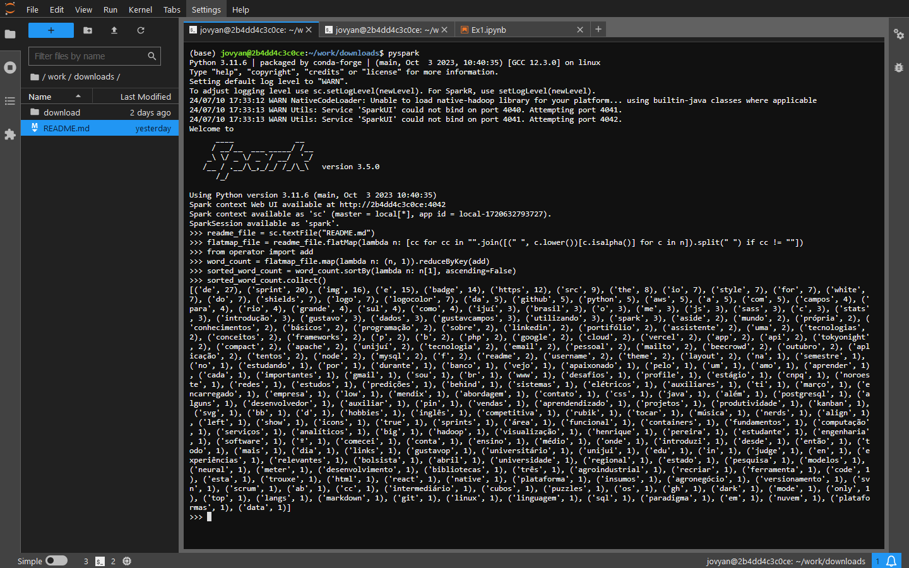
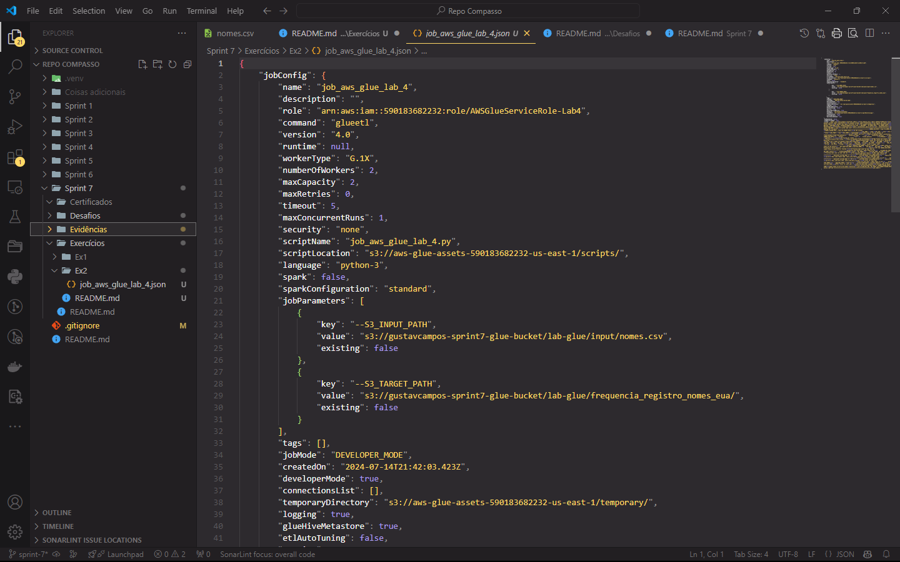
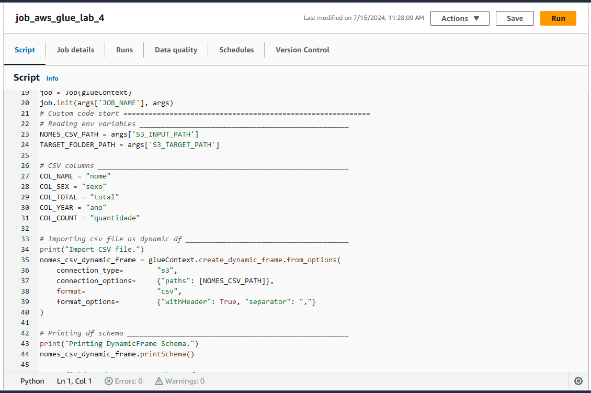
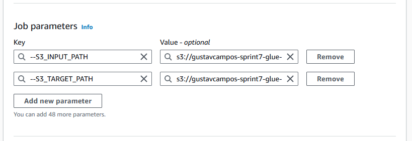
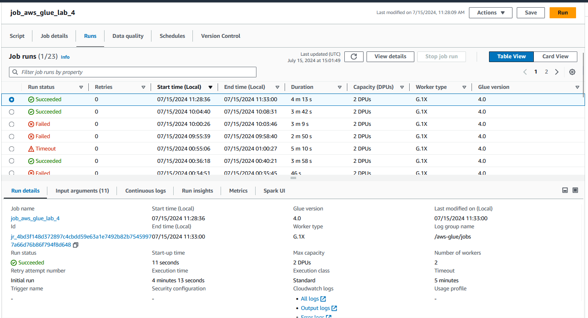
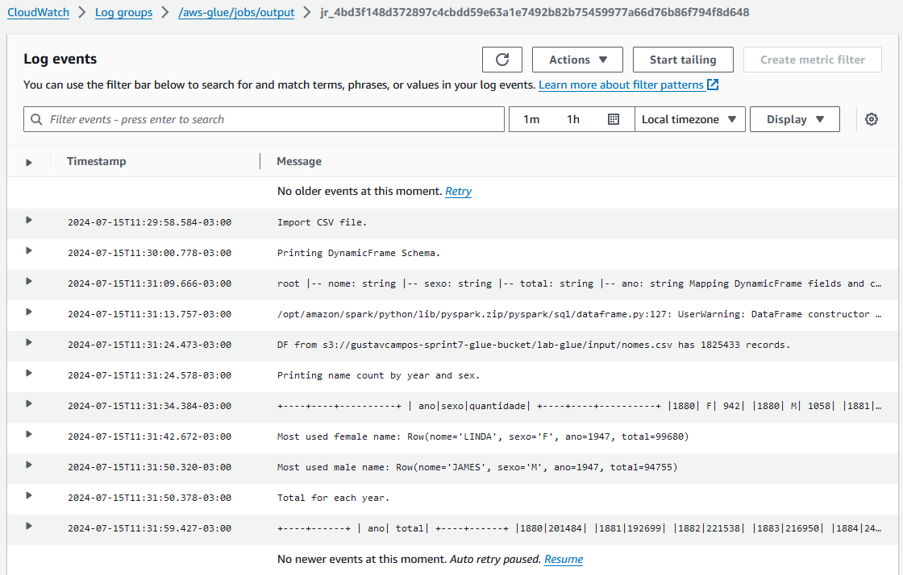
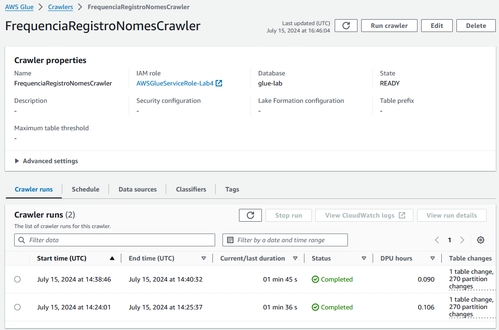
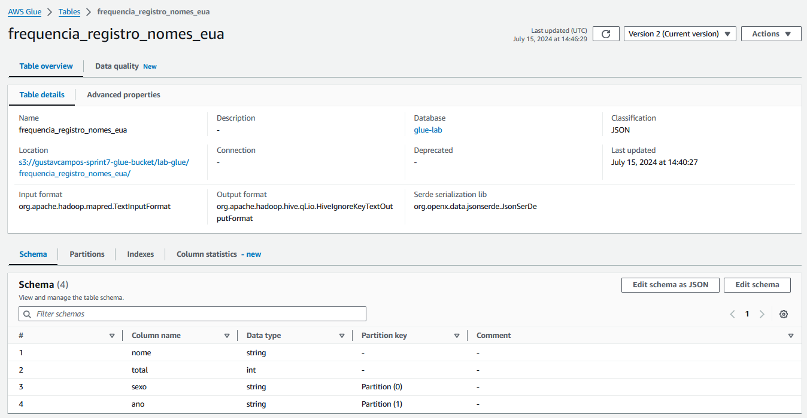
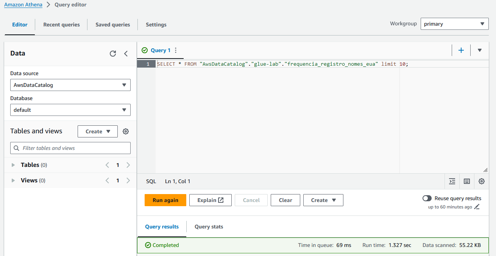
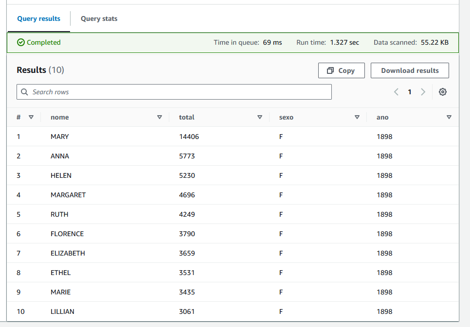

# Exercícios Sprint 7

1. [Contador de Palavras com PySpark](Ex1/)

2. [Laboratório AWS Glue](Ex2/)

# Evidências dos exercícios

* Comandos PySpark realizados para contagem de palavras do arquivo [README.md](../../README.md).

* Arquivo [job_aws_glue_lab_4.json](../Exercícios/Ex2/job_aws_glue_lab_4.json) que descreve o Glue Job criado no exercício.

* Trecho do script criado para Job do AWS Glue.

* Parâmetros inseridos no AWS Glue Job criado.

* Execuções do AWS Glue Job criado.

* Log de execução do AWS Glue Job criado.

* Crawler criado para o AWS Glue.

* Crawler criado para o AWS Glue.

* *Schema* da base de dados criada pelo crawler.

* Query criada no AWS Athena para consultar a base de dados criada pelo crawler.

* Resultado da query criada no AWS Athena.

