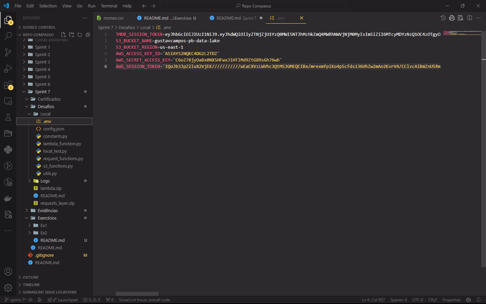
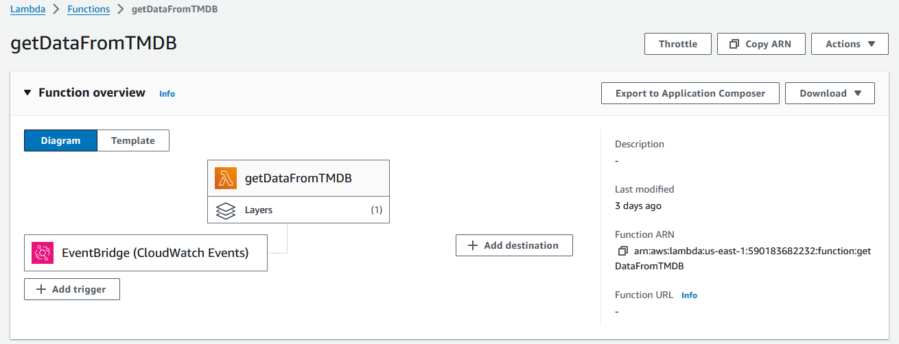
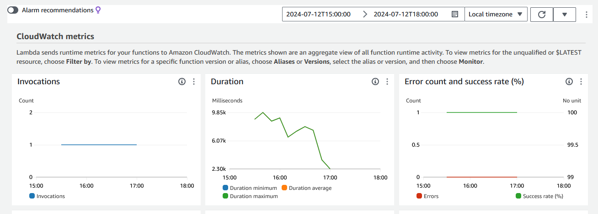
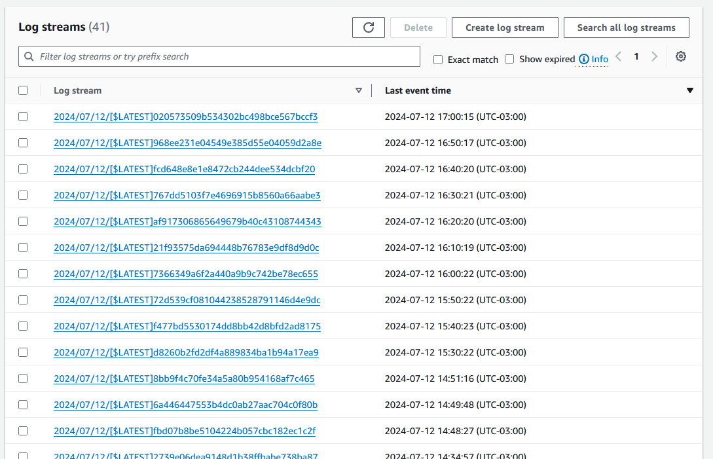

# Desafio

1. [Ingerindo dados de uma API em um data lake usando AWS Lambda](Desafios/)

# Exercícios

1. [Arquivo Markdown para os Exercícios](Exercícios/)

# Evidências

* Arquivo ***.env*** que serve para emular as variáveis de ambiente da função Lambda no ambiente local.

* Visão geral da função Lambda criada para o desafio.

* Ambiente de desenvolvimento da função Lambda com código criado.

* Propriedades do código utilizado na função Lambda criada para o desafio.

* Permissões da função Lambda criada para o desafio.

*  Variáveis de ambiente configuradas para o a função Lambda criada para o desafio.

* EventBridge Trigger criado para execução recorrente da função Lambda criada para o desafio.

* Métricas de execução  da função Lambda criada para o desafio.

* Lista das streams de Logs geradas pelas exeções da função Lambda.

* Logs gerados pela execução da função lambda:
    * Log com progresso incompleto: [log-normal-process.csv](Desafios/Logs/log-normal-process.csv)
    * Lof com progresso completo: [log-finished-process.csv](Desafios/Logs/log-finished-process.csv)