# Etapas

## Contextualização do Desafio Final:

* Como a Squad 1 deve abordar filmes/séries de comédia ou animação, tenho como idéia inicial verificar se o gênero de animação possuía algum tipo de estigma e caso verdadeiro, como ele evoluiu ao longo do tempo.
* Pretendo verificar quais genêros que mais aparecem em conjunto com animação em cada década. 
* Pretendo também verificar se os filmes mais conhecidos dos atores vindo dos dados do IMDB possuem o gênero animação.

## Processamento dos Dados para Camada Trusted:

* Script para Dados Locais (IMDB): [createTrustedDataLocal.py](createTrustedDataLocal.py)
* Script para Dados do TMDB: [createTrustedDataTMDB.py](createTrustedDataTMDB.py)
---

# Fluxos de Execução

## Funções Gerais
Aqui vamos explorar o fluxo de execução e a entrada/saída de algumas funções que aparecem em ambos os scripts feitos.

### Funções de manipulação de URIs do S3
```python
def uri_to_bucket_name(uri: str) -> str:
    # s3://gustavcampos/2024/07/01/movies.csv -> gustavcampos

def uri_to_s3_key(uri: str) -> str:
    # s3://gustavcampos/2024/07/01/movies.csv -> 2024/07/01/movies.csv

def s3_key_to_uri(obj_key: str, bucket_name: str) -> str:
    # 2024/07/01/movies.csv, gustavcampos -> s3://gustavcampos/2024/07/01/movies.csv

def s3_key_to_date(obj_key: str) -> str:
    # s3://gustavcampos/2024/07/01/movies.csv -> 2024-07-01
```

### Funções de Requisição

#### *get_genre_map*

```python
def get_genre_map(url: str, header: dict) -> dict:
```

Função encarregada de criar um mapeamento dos nomes dos gêneros registrados na API do TMDB.
- **Parâmetros**
	- *url*: ***str*** informando a url da requisição.
	- *header*: ***dict*** contendo as informações do cabeçalho da requisição.
- **Retorno**: ***dict*** no modelo ```id: nome``` dos gêneros disponibilizados pela API.

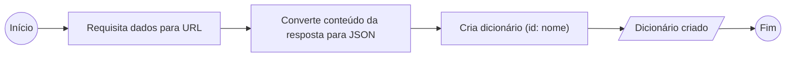

### Funções Usando PySpark

#### *map_columns_df*

```python
def map_columns_df(spark_df: DataFrame, mapping: list,  null_symbol: str="None") -> DataFrame:
```

Mapeia multiplas colunas de um DataFrame a partir de uma lista de mapeamento
- **Parâmetros**
	- *spark_df*: ***pyspark.sql.DataFrame*** a ser mapeado.
	- *mapping*: ***list*** onde cada item é uma tupla ```(<nome coluna>, <nome coluna desejado>, <tipo desejado>)```.
	- *null_symbol*: ***str*** valor a ser reconhecido como nulo.
- **Retorno**: novo ***pyspark.sql.DataFrame*** com colunas e valores mapeados. 

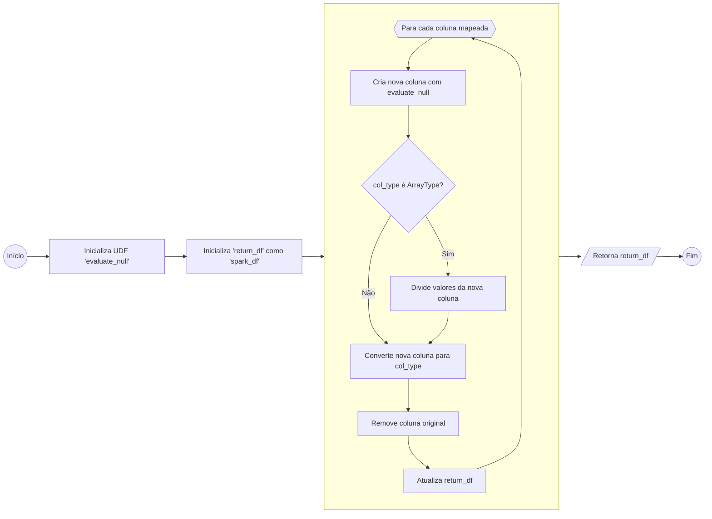

#### *rename_columns*
```python
def rename_columns(spark_df: DataFrame, mapping: list) -> DataFrame:
```

Renomeia multiplas colunas de um DataFrame a partir de uma lista de mapeamento.
- **Parâmetros**
	- *spark_df*: ***pyspark.sql.DataFrame*** a ser mapeado.
	- *mapping*: ***list*** onde cada item é uma tupla ```(<nome coluna>, <nome coluna desejado>)```.
- **Retorno**: novo ***pyspark.sql.DataFrame*** com colunas mapeadas.

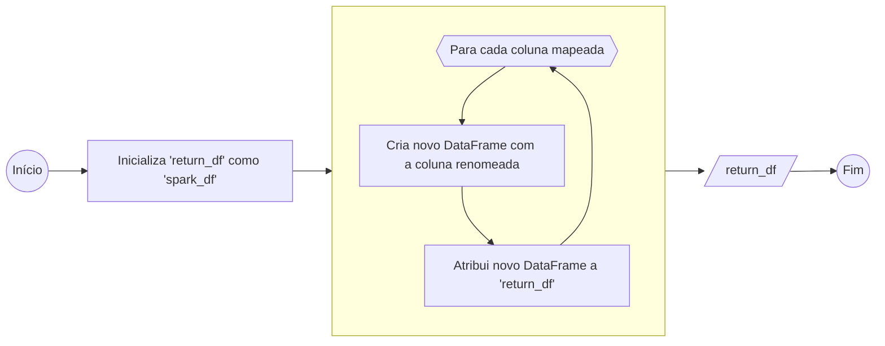

### Funções Para o Glue Job

#### *load_args*

```python
def load_args(arg_list: list=None, file_path: str=None) -> dict:
```

Função criada para verificar onde o Job está sendo rodado (AWS ou Local) e adquirir os parâmetros necessários de acordo com o ambiente. 
- **Parâmetros**
	- *arg_list*: ***list[str]*** onde cada valor indica um parâmetro definido para o Job.
	- *file_path*: ***str*** que indica o caminho relativo ao script para um arquivo JSON com os parâmetros definidos para o Job.
- **Retorno**: ***dict*** com chave:valor dos parâmetros lidos.

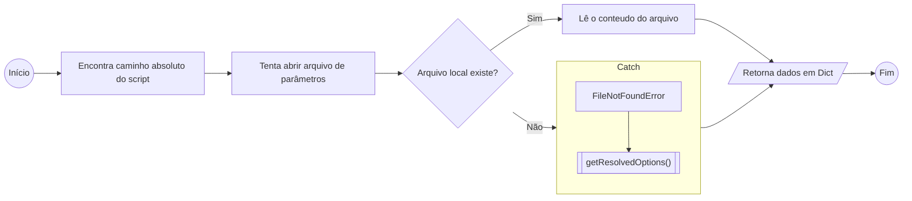

#### *generate_unified_df*

```python
def generate_unified_df(glue_context: GlueContext, s3_client: boto3.client, s3_path: str,  
                        file_format: str, format_options: dict) -> DataFrame:
```

Gera um DataFrame a partir de múltiplos arquivos dentro de uma pasta especificada no S3.
- **Parâmetros**
	- *glue_context*: ***GlueContext*** criado para Job.
	- *s3_client*: Um ***boto3.client*** conectado ao s3.
	- *s3_path*: URI do bucket/pasta que deseja procurar os arquivos.
	- *file_format*: Parâmetro ***format*** de ***GlueContext.create_dynamic_frame.from_options***.
	- *format_options*: Parâmetro ***format_options*** de ***GlueContext.create_dynamic_frame.from_options***.
- **Retorno**: ***pyspark.sql.DataFrame*** com valores de todos os objetos encontrados.

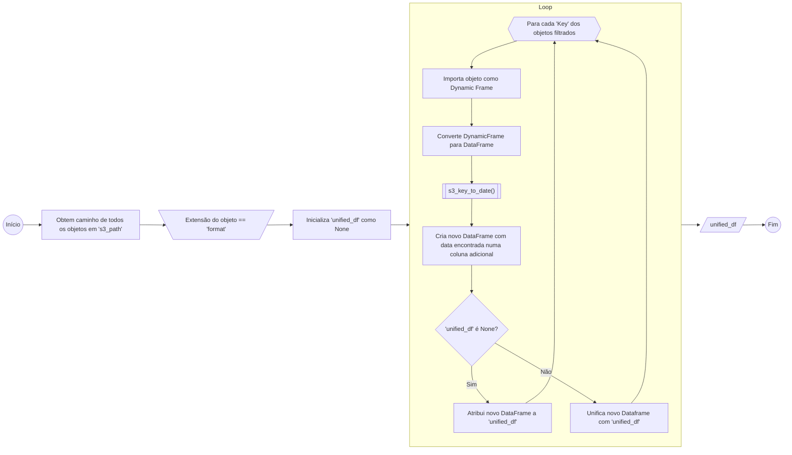

## Fluxo Glue Job createTrustedDataLocal
Fluxo que ocorre na função ***main()***:

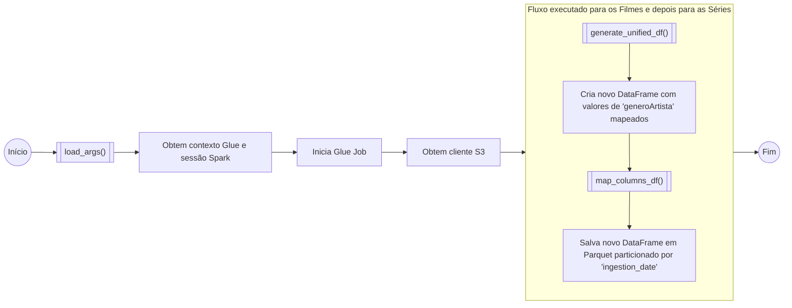


## Fluxo Glue Job createTrustedDataTMDB

Fluxo que ocorre na função ***main()***:

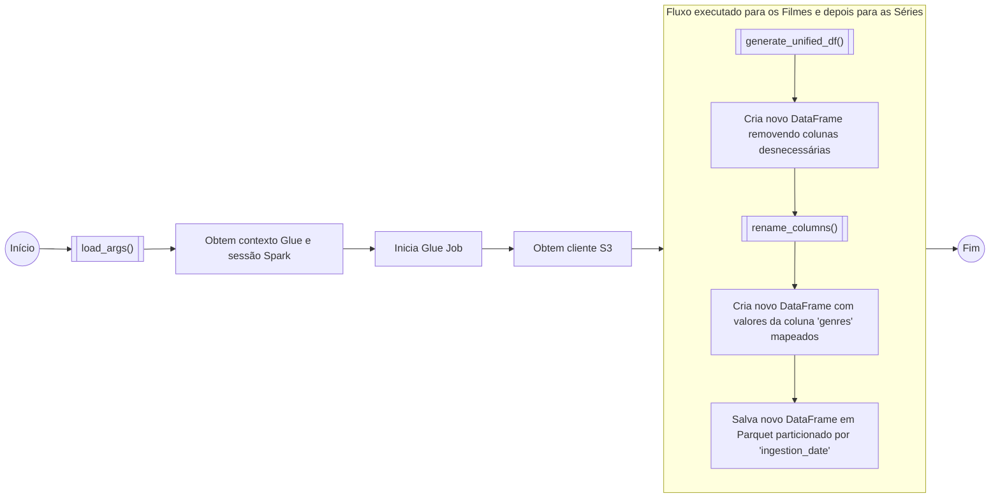

---

# Passos para reexecução do desafio

## Setup de Permissões/Ambiente

Como primeiro passo é necessário criar uma role para utilização do AWS Glue e AWS Lake Formation.
O cargo deve possuir as seguintes permissões:
- AmazonS3FullAccess;
- AWSGlueConsoleFullAccess;
- AWSLakeFormationDataAdmin;
- CloudWatchFullAccess.
Vamos utilizar o nome ***AWSGlueServiceRole_DataLakeTrustedLayer***.

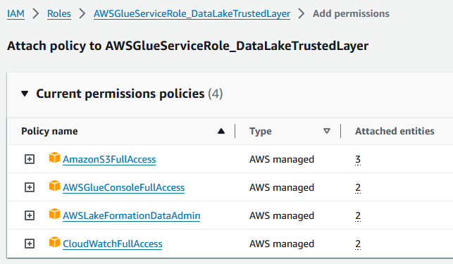

Com a role criada, podemos configurar as permissões do AWS Lake Formation.
- Vamos acessar o dashboard do AWS Lake Formation;
- Vamos criar uma database chamada ***movies_and_series_data_lake***;
- Devemos conceder a role criada permissões de acesso a database.

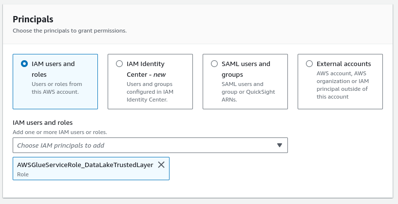
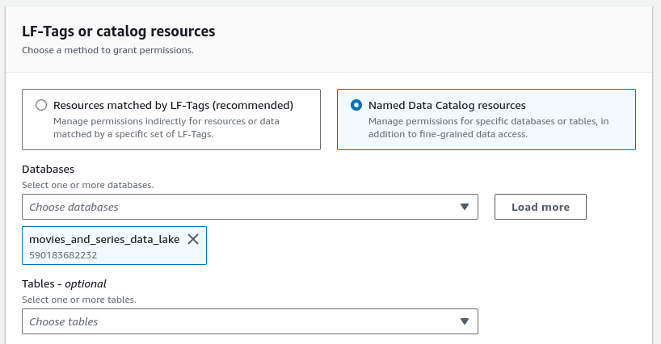


## Criando AWS Glue Jobs
Como primeiro passo devemos acessar o dashboard do AWS Glue. 
Dentro deste dashboard podemos seguir os seguintes passos para criar um job:
1. Vamos acessar a aba **ETL JOBS** na barra lateral do dashboard;
2. Dentro da seção **Create Job*, selecione ***Script Editor***;
3. Ecolha a opção ***Spark*** como engine e selecione ***start fresh*** na parte de opções;
4. Ao final você deverá se encontrar na seguinte tela:

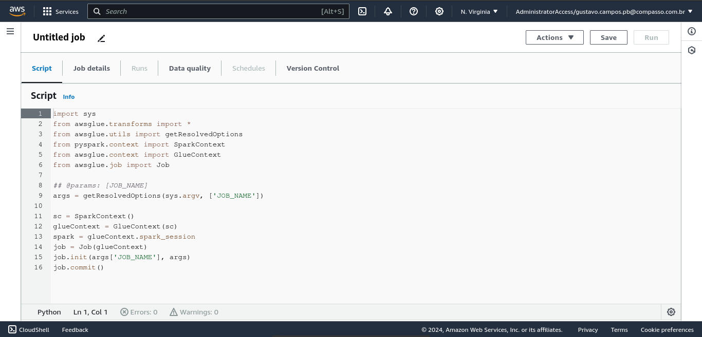

### createTrustedDataLocal
Considerando que você está na interface de um job recém criado:
- Altere o nome do Job para ***createTrustedDataLocal***;
- Na aba de ***Scripts*** cole o código encontrado em [createTrustedDataLocal.py](createTrustedDataLocal.py);
- Na aba de ***Job Details*** configure:
	- **IAM Role**: AWSGlueServiceRole_DataLakeTrustedLayer;
	- **Type**: Spark;
	- **Glue Version**: Glue 4.0;
	- **Language**: Python 3;
	- **Worker Type**: G 1x (4vCPU and 16GB RAM);
	- **Requested number of workers**: 2;
	- **Job Timeout**: 5.
- Na aba de ***Job Details***, acesse a parte de propriedades avançadas e adicione os seguintes parâmetros:
	- **S3_MOVIE_INPUT_PATH**: URI para pasta com arquivos CSV de filmes;
	- **S3_SERIES_INPUT_PATH**: URI para pasta com arquivos CSV de séries;
	- **S3_TARGET_PATH**: URI para pasta que define a camada *Trusted*.
 
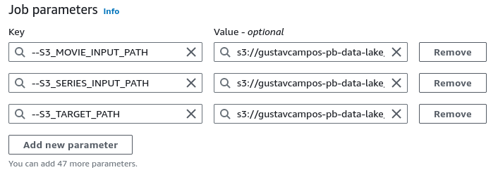	

- Por último garanta que as configurações foram salvas.

### createTrustedDataTMDB
Considerando que você está na interface de um job recém criado:
- Altere o nome do Job para ***createTrustedDataTMDB***;
- Na aba de ***Scripts*** cole o código encontrado em [createTrustedDataTMDB.py](createTrustedDataTMDB.py);
- Na aba de ***Job Details*** configure:
	- **IAM Role**: AWSGlueServiceRole_DataLakeTrustedLayer;
	- **Type**: Spark;
	- **Glue Version**: Glue 4.0;
	- **Language**: Python 3;
	- **Worker Type**: G 1x (4vCPU and 16GB RAM);
	- **Requested number of workers**: 2;
	- **Job Timeout**: 5.
- Na aba de ***Job Details***, acesse a parte de propriedades avançadas e adicione os seguintes parâmetros:
	- **S3_MOVIE_INPUT_PATH**: URI para pasta com arquivos JSON de filmes;
	- **S3_SERIES_INPUT_PATH**: URI para pasta com arquivos JSON de séries;
	- **S3_TARGET_PATH**: URI para pasta que define a camada *Trusted*;
	- **TMDB_TOKEN**: Token de sessão para acesso a API do TMDB.
 
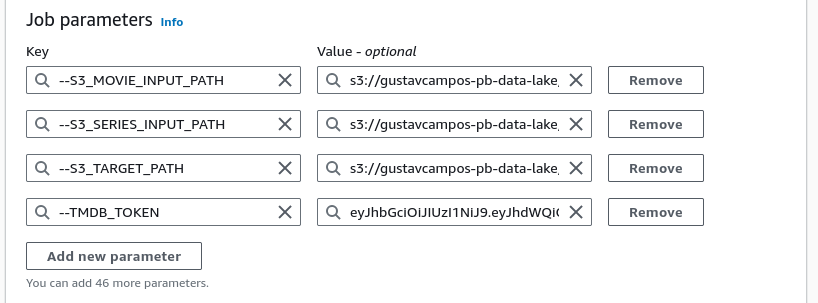	

- Por último garanta que as configurações foram salvas.

## Criando AWS Glue Crawlers
Como primeiro passo é necessário rodar ambos os Jobs criados com sucesso.
- Caso ainda não tenha executado, execute os Jobs criados;
- Dentro da dashboard do AWS Glue, acesse a aba de ***Job run monitoring*** na barra lateral;
- Verifique a seção ***Job Runs*** e procure se ambos os Jobs possuem *Run Status* como **Succeeded**.

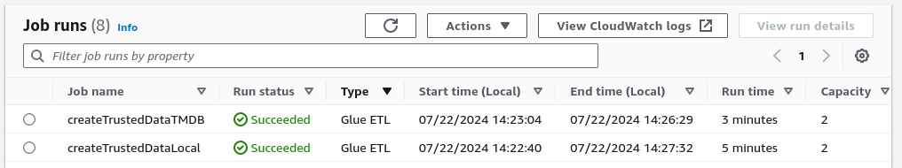

Agora podemos criar os crawlers.
- Dentro da dashboard do AWS Glue, acesse a aba de ***Crawlers*** na barra lateral;
- Selecione criar crawler;
- Você deverá se encontrar na seguinte aba:

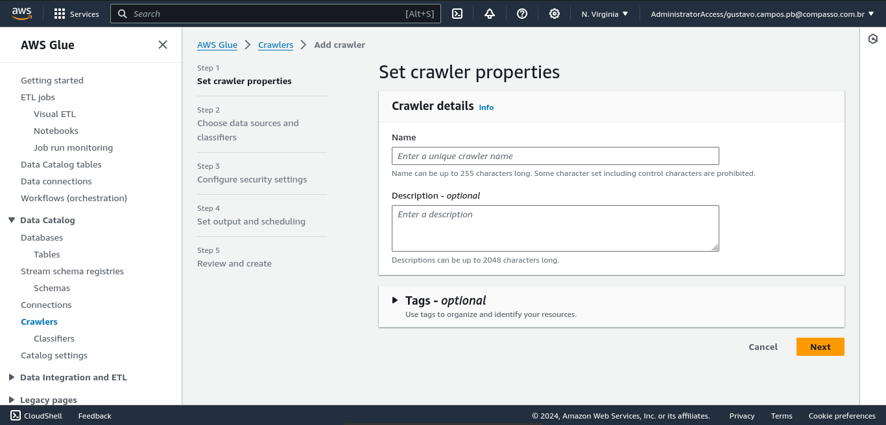

### createTrustedLocalDataCrawler
Considerando que você está na interface de um crawler recém criado:
- **Passo 1 - Propriedades:**
	- Defina o nome do crawler como ***createTrustedLocalDataCrawler***
- **Passo 2 - Fonte dos dados:**
	- Na opção *Is your data already mapped to Glue tables?*, selecione ***Not yet***;
	- Em **Data Sources** adicione as seguintes fontes:
		- Pasta S3 Local/Movies da camada Trusted;
		- Pasta S3 Local/Series da camada Trusted.
- **Passo 3 - Segurança:**
	- Em **IAM Role**, selecione a role criada anteriormente (AWSGlueServiceRole_DataLakeTrustedLayer).
- **Passo 4 - Output e Agendamento:**
	- Selecione a database criada (movies_and_series_data_lake) como ***Target database***;
	- Em ***Table name prefix***, preencha com ```IMDB_```;
	- Em ***Crawler Schedule*** selecione a frequência como ```On demand```.
- **Passo 5 - Revisão:**
	- Revise as configurações do crawler;
	- Crie/Atualize o crawler.

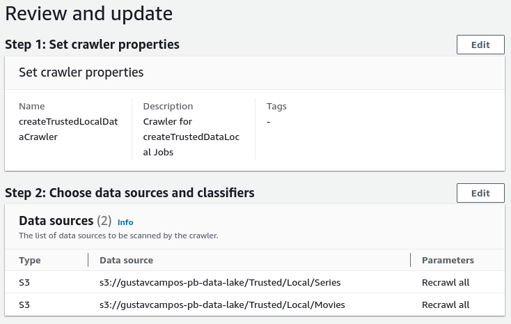
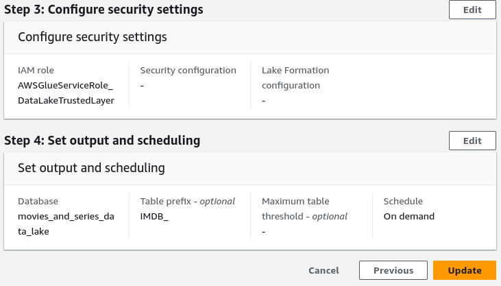

### createTrustedTMDBDataCrawler
Siga os mesmos passos do crawler anterior, será necessário fazer apenas as seguintes alterações:
- **Passo 1**: defina o nome como ***createTrustedTMDBDataCrawler***;
- **Passo 2**: adicione as fontes seguintes fontes:
	- Pasta S3 TMDB/Movies da camada Trusted;
	- Pasta S3 TMDB/Series da camada Trusted.
- **Passo 4**: defina ***Table prefix*** como ```TMDB_```.

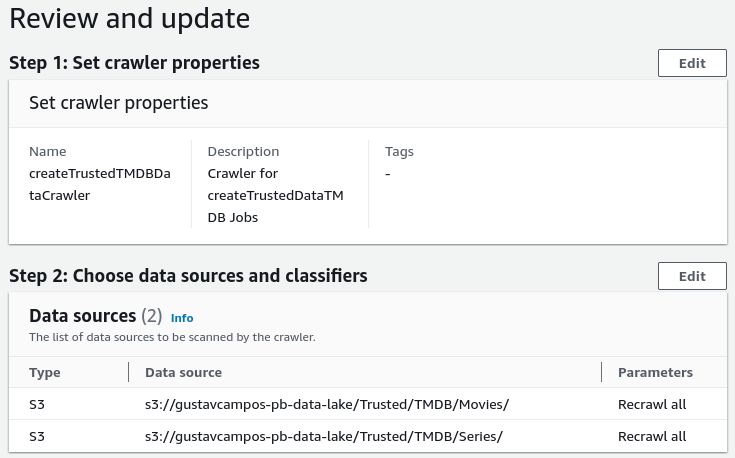
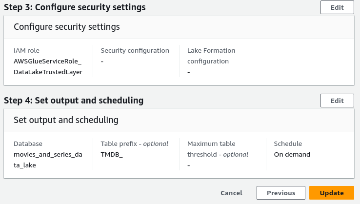

### Executando Crawlers
Podemos executar os crawler seguindo os seguintes passos:
- Dentro da dashboard do AWS Glue, acesse a aba de ***Crawlers*** na barra lateral;
- Selecione os dois crawlers criados;
- Aguarde a coluna ***Last run*** estar como ```Succeeded``` em ambos os crawlers.

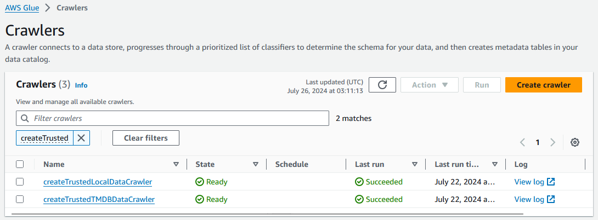

## Verificando Catálogo e Tabelas Criados
Podemos verificar as tabelas criadas pelos crawlers usando o AWS Athena.
- Na barra de pesquisa digite ```athena```;
- Acesse a opção **Athena**;
- Você deverá ser direcionado para a página ***Query editor***, caso contrário, acesse ela pela barra lateral;
- Na aba ***Editor***, do lado esquerdo na seção **Data**, configure:
	- **Data Source**: AwsDataCatalog;
	- **Database**: movies_and_series_data_lake;
- Abaixo da seção ***Data**, em **Tables** deverá aparecer as seguintes tabelas:

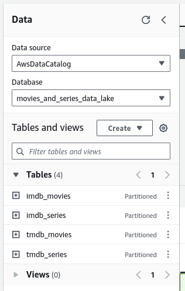

Agora podemos acessar os dados utilizando consultas SQL!

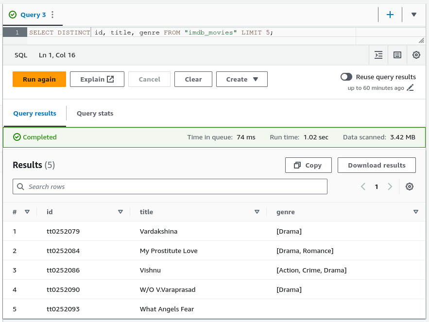
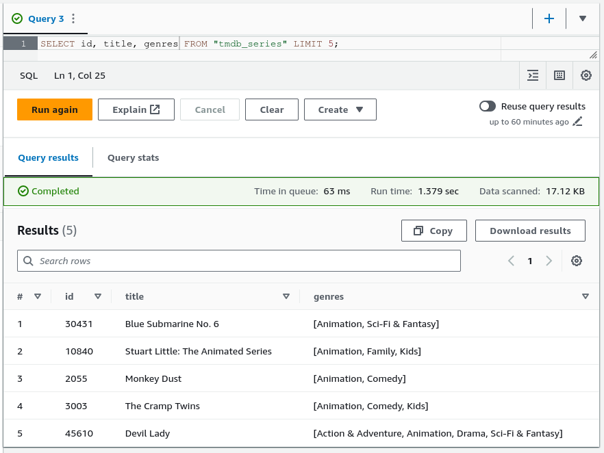
