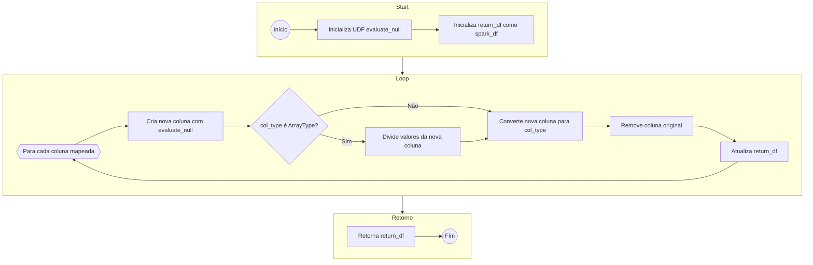
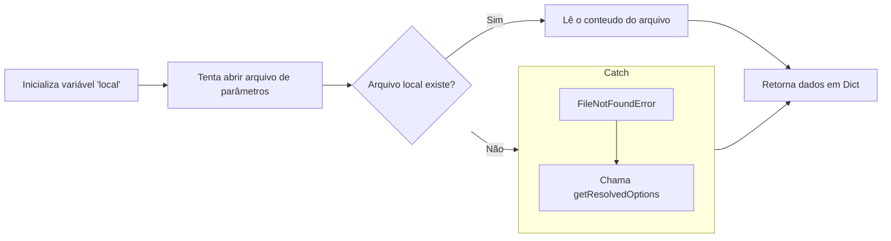

# Etapas

## Contextualização do Desafio Final:

* Como a Squad 1 deve abordar filmes/séries de comédia ou animação, tenho como idéia inicial verificar se o gênero de animação possuía algum tipo de estigma e caso verdadeiro, como ele evoluiu ao longo do tempo.
* Pretendo verificar quais genêros que mais aparecem em conjunto com animação em cada década. 
* Pretendo também verificar se os filmes mais conhecidos dos atores vindo dos dados do IMDB possuem o gênero animação.

## Processamento dos Dados para Camada Trusted:

* Script para Dados Locais (IMDB): [createTrustedDataLocal.py](createTrustedDataLocal.py)
* Script para Dados do TMDB: [createTrustedDataTMDB.py](createTrustedDataTMDB.py)
---

# Fluxos de Execução

## Funções Gerais
Aqui vamos explorar o fluxo de execução e a entrada/saída de algumas funções que aparecem em ambos os scripts feitos.

### Funções de manipulação de URIs do S3
```python
def uri_to_bucket_name(uri: str) -> str:
    # s3://gustavcampos/2024/07/01/movies.csv -> gustavcampos

def uri_to_s3_key(uri: str) -> str:
    # s3://gustavcampos/2024/07/01/movies.csv -> 2024/07/01/movies.csv

def s3_key_to_uri(obj_key: str, bucket_name: str) -> str:
    # gustavcampos, 2024/07/01/movies.csv -> s3://gustavcampos/2024/07/01/movies.csv

def s3_key_to_date(obj_key: str) -> str:
    # s3://gustavcampos/2024/07/01/movies.csv -> 2024-07-01
```

### Funções Usando PySpark
```python
def map_columns_df(spark_df: DataFrame, mapping: list,  null_symbol: str="None") -> DataFrame:
```



### Funções Para o Glue Job
```python
def load_args(arg_list: list=None, file_path: str=None) -> dict:
```



## Fluxo Glue Job createTrustedDataLocal

```mermaid

```

## Fluxo Glue Job createTrustedDataTMDB

---

# Passos para reexecução do desafio

## Criando Função Lambda

Dentro do console da AWS devemos fazer os seguintes passos:

* Acesse página de funções do AWS Lambda;
* Selecione criar função:
    * Escolha a opção **"author from scratch"**;
    * Coloque o nome da função como **getDataFromTMDB**;
    * Escolha **Python 3.11** como runtime;
    * Vá ao final da página e selecione criar função.
* Após a criação da função você devera ser redirecionado para a página da mesma, caso contrário acesse a função criada;
* Desça até a seção de código fonte (**code source**);
* Envie os arquivos de [lambda.zip](lambda.zip) na opção da parte superior direita (**Upload From**);
* Ao final você deverá ter um ambiente dev parecido com o seguinte:


## Configurando Variáveis, Permissões e Camadas

### Configurando acesso ao S3
