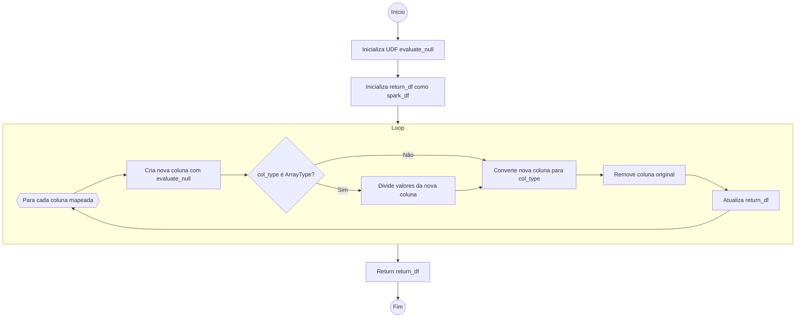
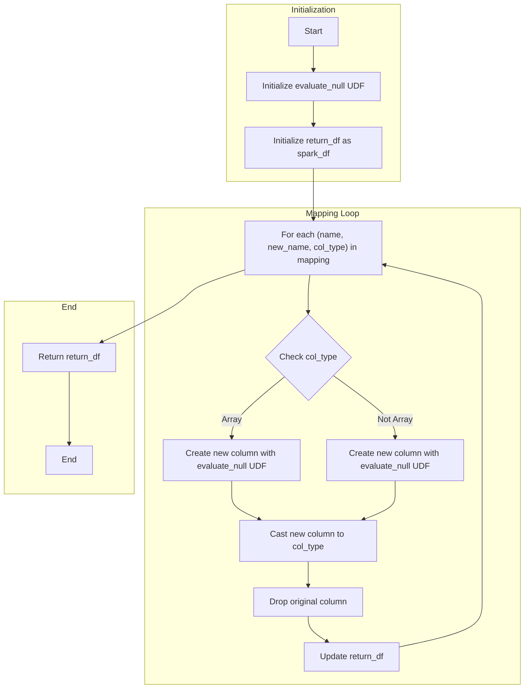

```mermaid
flowchart TD
    flow_start((Início))
    i_evaluate_null[Inicializa UDF evaluate_null]
    i_return_df[Inicializa return_df como spark_df]
    return[Return return_df]
    flow_end((Fim)) 

    subgraph Loop
        column_loop{{Para cada coluna mapeada}}
        col_is_array{col_type é ArrayType?}
        evaluate_null[Cria nova coluna com evaluate_null]
        explode_values[Divide valores da nova coluna]
        cast_type[Converte nova coluna para col_type]
        drop_col[Remove coluna original]
        update_return[Atualiza return_df]

        column_loop --> evaluate_null
        evaluate_null --> col_is_array
        col_is_array -->|Sim| explode_values
        col_is_array -->|Não| cast_type
        explode_values --> cast_type
        cast_type --> drop_col
        drop_col --> update_return
        update_return --> column_loop
    end

    flow_start --> i_evaluate_null
    i_evaluate_null --> i_return_df
    i_return_df --> Loop
    Loop --> return
    return --> flow_end
```

```mermaid
graph TD
    subgraph Initialization
        A[Start] --> B[Initialize evaluate_null UDF]
        B --> C[Initialize return_df as spark_df]
    end

    subgraph Mapping Loop
        C --> D["For each (name, new_name, col_type) in mapping"]
        D --> E{Check col_type}
        E -->|Array| F[Create new column with evaluate_null UDF]
        E -->|Not Array| G[Create new column with evaluate_null UDF]
        
        F --> H[Split new column into array]
        G --> H[Cast new column to col_type]
        H --> I[Drop original column]
        I --> J[Update return_df]
        J --> D
    end

    subgraph End
        D --> K[Return return_df]
        K --> L[End]
    end
```