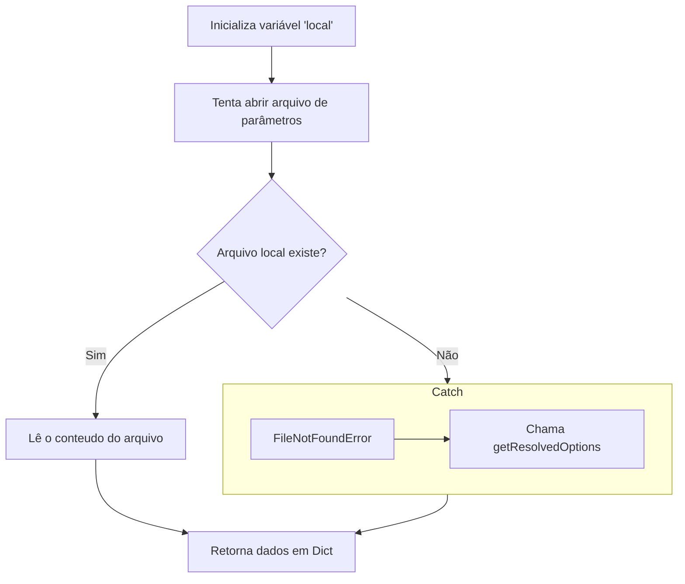

### Funções Para o Glue Job
```python
def load_args(arg_list: list=None, file_path: str=None) -> dict:
```

```mermaid
flowchart TD
    script_local["Inicializa variável 'local'"]

    subgraph Catch
        error[FileNotFoundError] --> call[Chama getResolvedOptions]
    end

    open_file[Tenta abrir arquivo de parâmetros]
    file_exists{Arquivo local existe?}
    read_json[Lê o conteudo do arquivo]

    open_file --> file_exists
    file_exists -- Sim --> read_json
    file_exists -- Não --> Catch

    script_local --> open_file
    read_json --> return_dict[Retorna dados em Dict]
    Catch --> return_dict
```