# Desafio

1. [Processamento para Camada Trusted](Desafios/)

# Exercícios

1. [Geração e Massa de Dados](Exercícios/Ex1/Ex1.ipynb)
2. [Apache Spark](Exercícios/Ex2/Ex2.ipynb)
1. [Consumo API TMDB](Exercícios/Ex3/tmdb_test.py)

# Evidências

* Arquivo txt criado no exercício 1 para ser usado no exercício 2 dentro do container Spark.

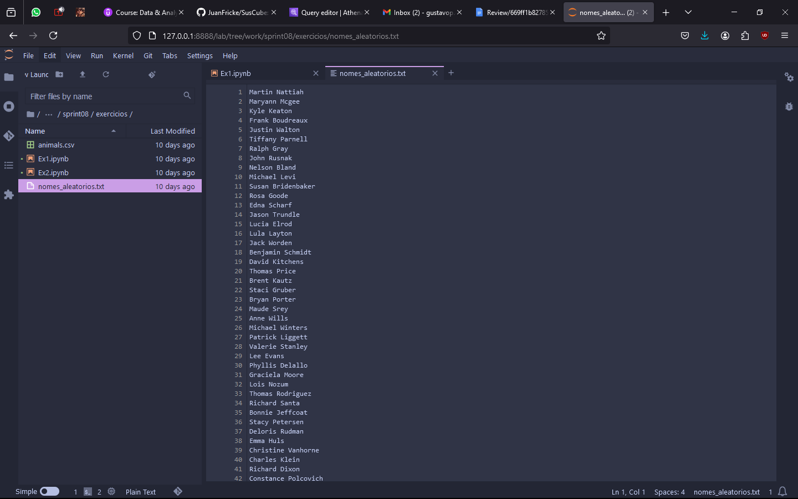


* Execução das etapas do exercício 2 dentro do container Spark.


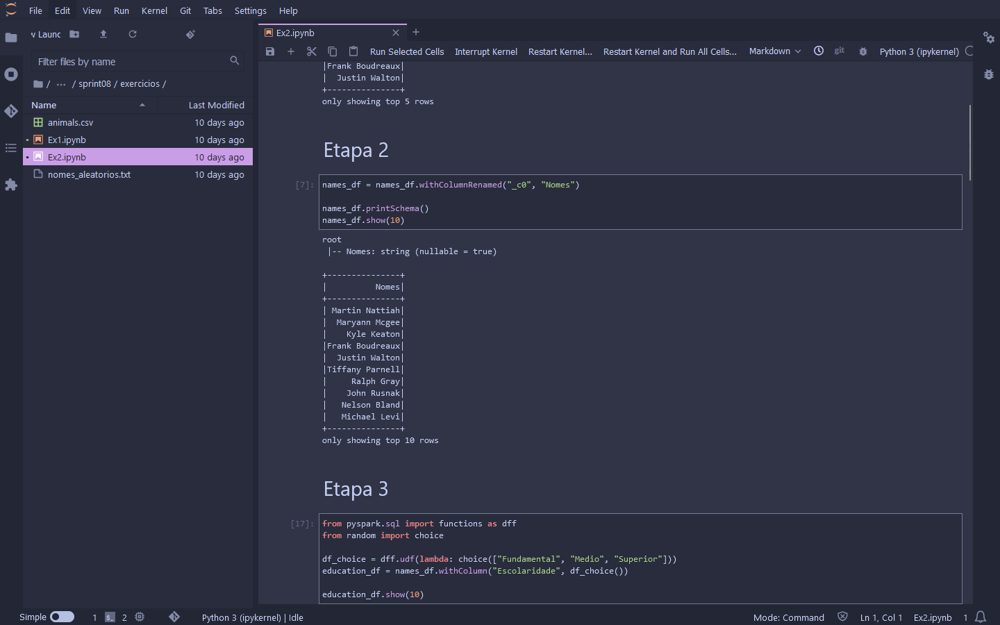

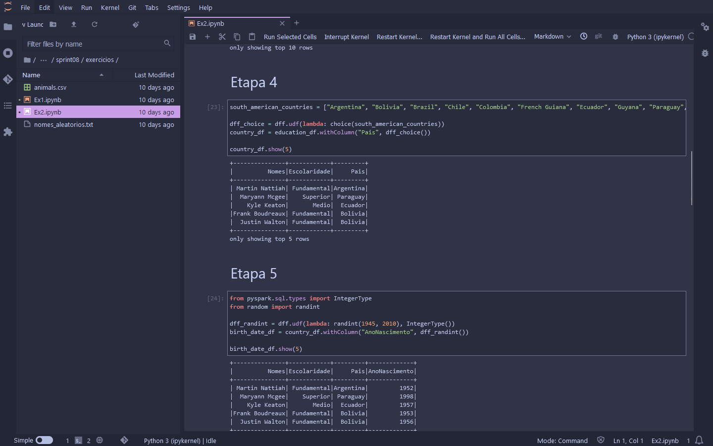
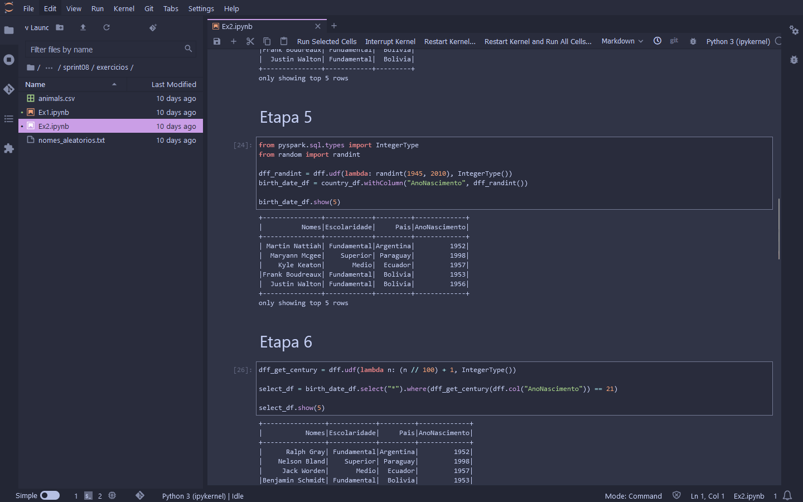
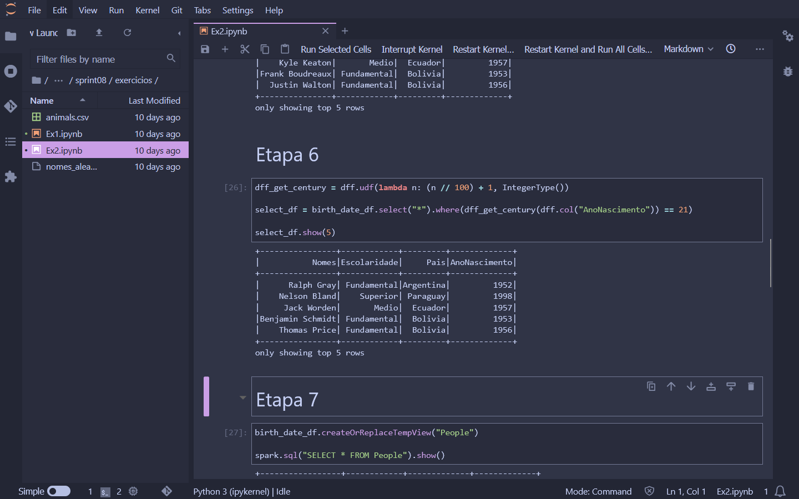
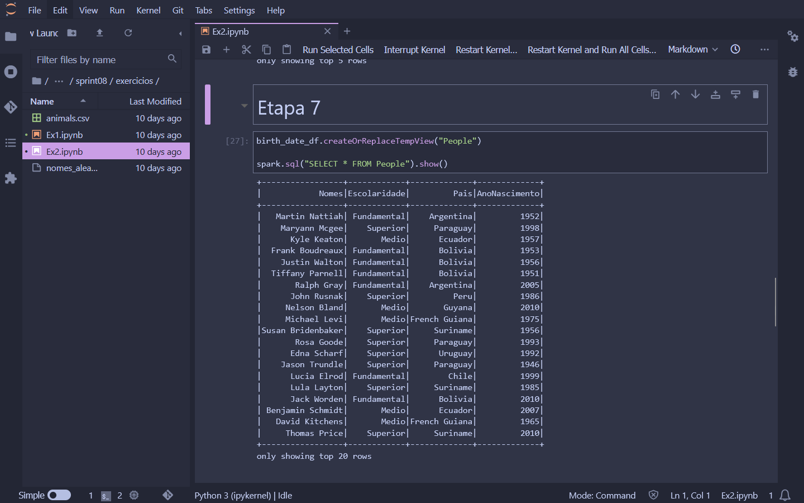
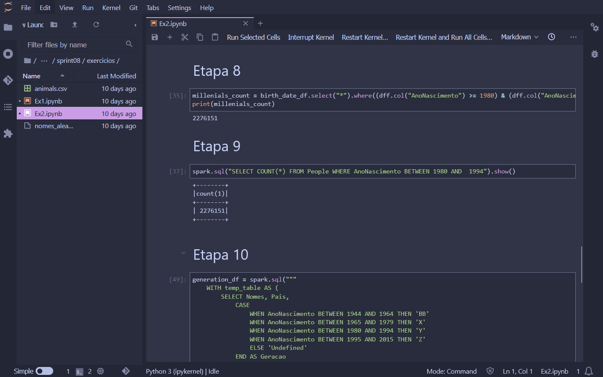
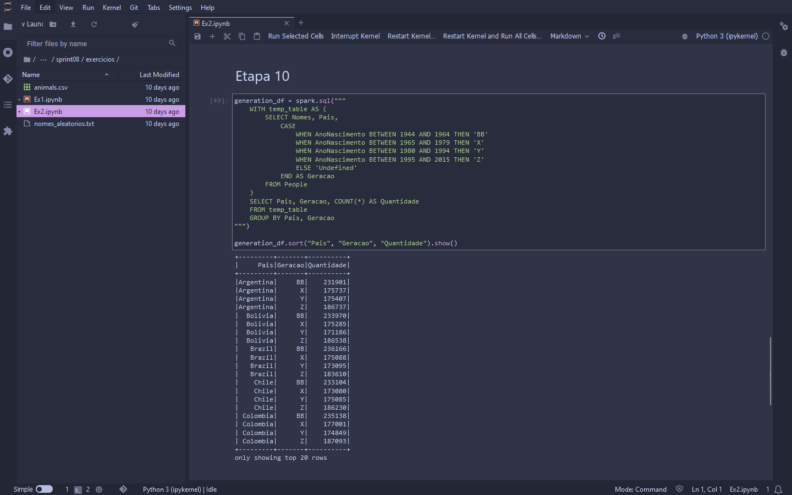


* Execução do Script [tmdb_test.py](Exercícios/Ex3/tmdb_test.py) criado para o exercício 3.

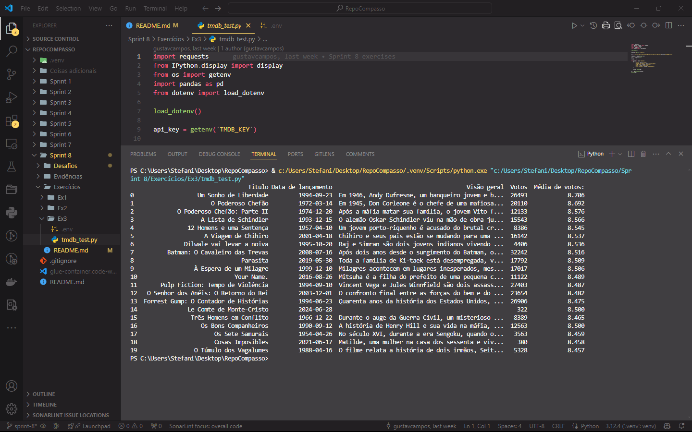

* Logs de execução do AWS Glue Job ```createTrustedDataLocal```:

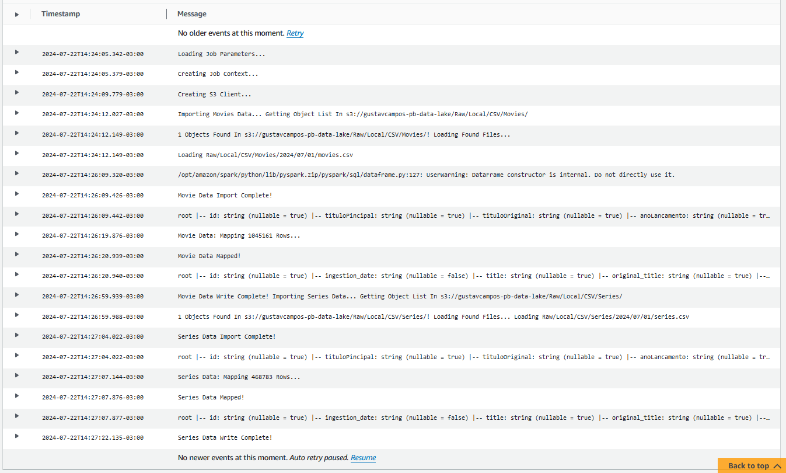

* Logs de execução do AWS Glue Job ```createTrustedDataTMDB```:

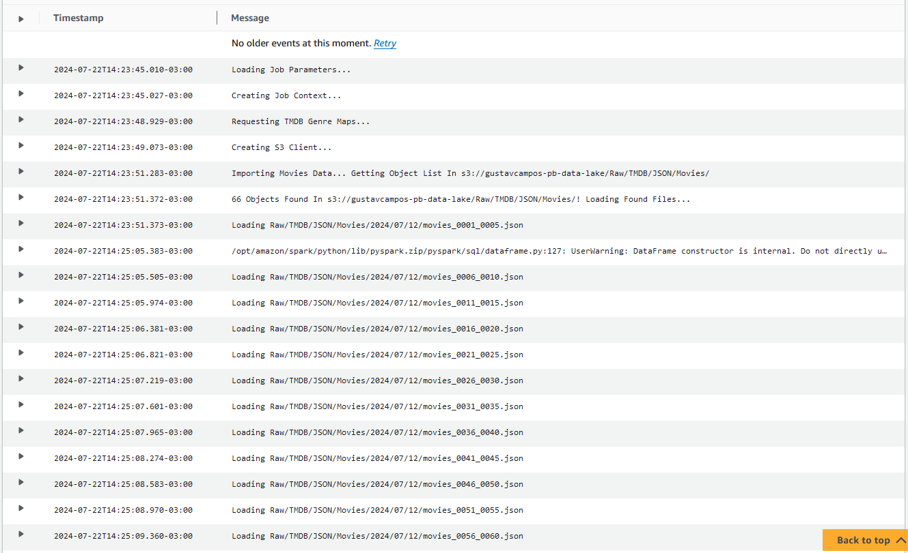
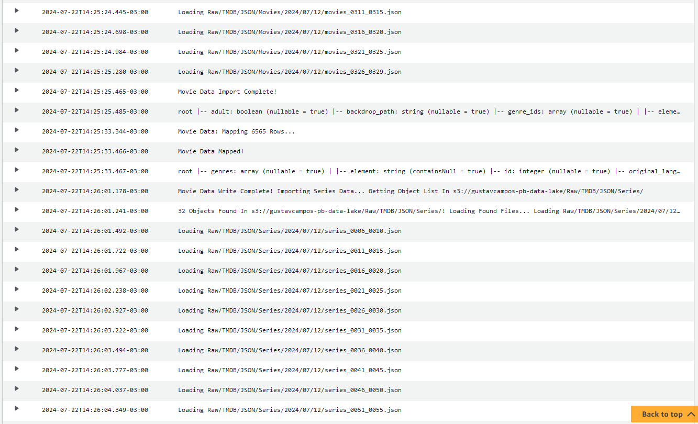
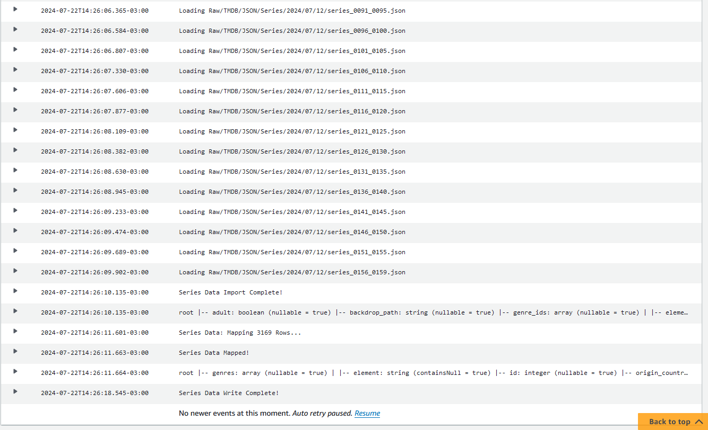

* Logs de execução do AWS Glue Crawler ```createTrustedLocalDataCrawler```:

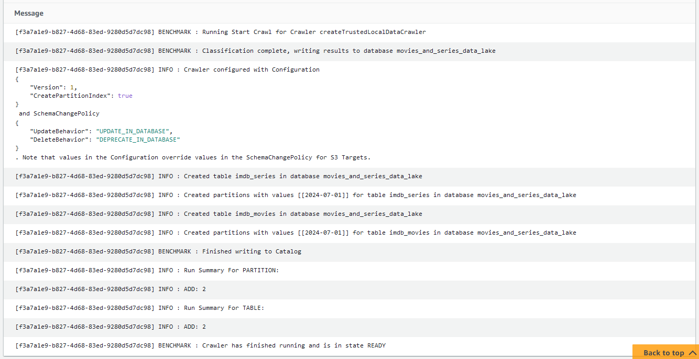

* Logs de execução do AWS Glue Crawler ```createTrustedTMDBDataCrawler```:

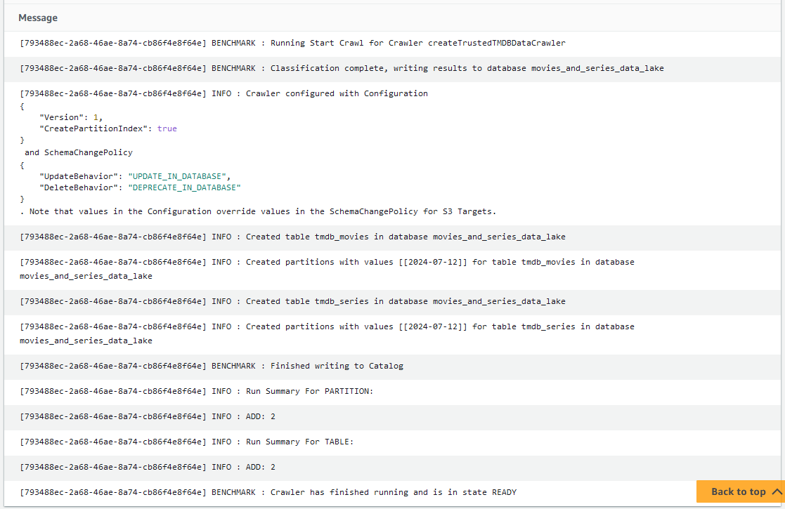

* Estrutura de diretórios do S3 para os arquivos temporários de teste durante desenvolvimento dos Jobs do Glue.

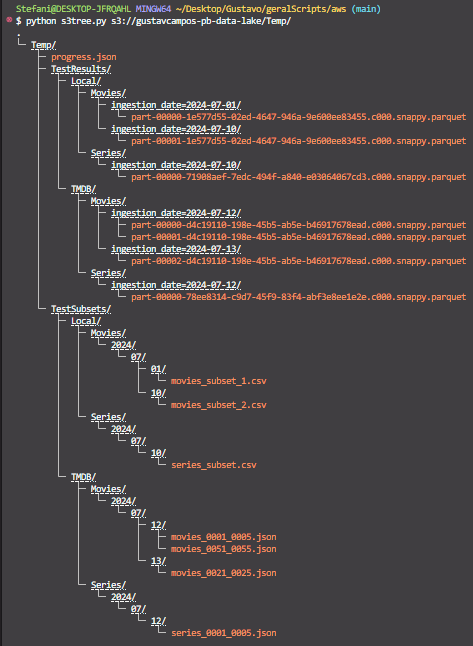

* Estrutura de diretórios do S3 para os arquivos da camada ***Raw***.

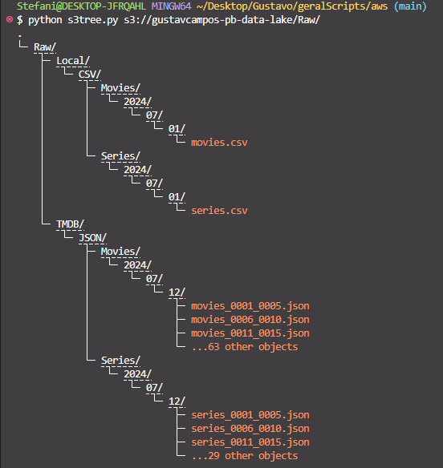

* Estrutura de diretórios do S3 para os arquivos criados para a camada ***Trusted*** pelos Jobs do Glue.

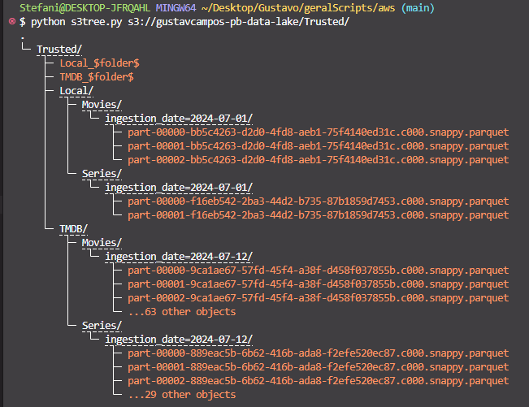

