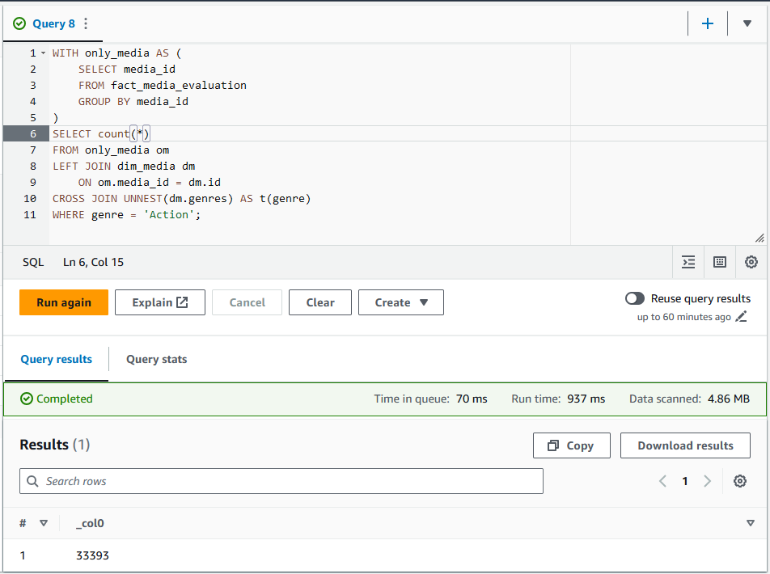

# Etapas

## Contextualização do Desafio Final:

* Como a Squad 1 deve abordar filmes/séries de comédia ou animação, tenho como objetivo verificar se o gênero de animação possuía algum tipo de estigma e caso verdadeiro, como ele evoluiu ao longo do tempo.
* Pretendo verificar quais genêros que mais aparecem em conjunto com animação em cada década. 
* Pretendo também outras questões como budget, popularidade, etc...

## Modelagem Dimensional:

### Tabela Fato

Para tabela fato, verifiquei dados quantitativos presentes nos dados Trusted/Local e Trusted/TMDB e selecionei os seguintes dados:

#### Dados Locais

| Na fonte | Processado |
| ----- | ----- |
| minute_duration | minute_duration |
| vote_average | vote_average |
| vote_count | vote_count |
| *None* | budget |
| *None* | revenue |
| *None* | popularity |

#### Dados TMDB

| Na fonte | Processado |
| ----- | ----- |
| runtime | minute_duration |
| vote_average | vote_average |
| vote_count | vote_count |
| budget | budget |
| revenue | revenue |
| popularity | popularity |

### Dimensão de Data (Tempo)

Para dimensão de tempo, verifiquei dados de marcação temporal e a partir deles vou gerar vários níveis de informação para estes dados.

#### Dados Local

| Na fonte | Processado |
| ----- | ----- |
| release_year | row(release_date) |
| end_year | row(end_date) |
| ingestion_date | row(ingestion_date) |

#### Dados TMDB

| Na fonte | Processado |
| ----- | ----- |
| release_date | row(release_date) |
| end_date | row(end_date) |
| ingestion_date | row(ingestion_date) |

### Dimensão de Pessoas

Para criar a dimensão de pessoas vamos ter dois tramentos diferentes.

#### Dados Local

Aqui os registros aparecem em redundância apenas alterando dados dos atores, ficando simples de extrair os dados.

| Na fonte | Processado |
| ----- | ----- |
| *None* | tmdb_id |
| artist_name | name |
| artist_genre( *M* ou *F* ) | gender( *male* ou *female* ) |
| birth_year | birth_year |
| death_year | death_year |
| occupation | occupation |
| *None* | popularity |

#### Dados TMDB

O DataFrame gerado pelos arquivos parquets do TMDB geram uma coluna com o seguinte struct:


Será necessário "explodir" estes dados para os extrair.

| Na fonte (cast) | Na fonte (crew) | Processado |
| - | - | - |
| id | id | tmdb_id |
| name | name | name |
| gender | gender | map(gender) |
| *None* | *None* | birth_year |
| *None* | *None* | death_year |
| lit("actor") | job | occupation |
| popularity | popularity | popularity |

### Dimensão de Mídia

Para esta dimensão vamos extrair os dados que descrevem as características da mídia.

#### Dados Locais

| Na fonte | Processado |
|-|-|
| *None* | tmdb_id |
| id | imdb_id |
| lit( *movie* ) ou lit( *series* ) | type |
| title | title |
| *None* | origin_country |
| genre | genres |

#### Dados TMDB

| Na fonte | Processado |
|-|-|
| id | tmdb_id |
| expr("NULL" ou "imdb_id") | imdb_id |
| lit( *movie* ) ou lit( *series* ) | type |
| title | title |
| origin_country | origin_country |
| genre | genres |

### Modelagem Completa

Como pode ser notado, nesta modelagem não utilizei os IDs originais dos dados como identificador para evitar conflitos nos registros, assim, será criado identificadores próprios para as tabelas.

Por fim temos o seguinte diagram de entidade e relacionamento:


## Processamento dos Dados para Camada Refined:

* Script para processar todos os dados da camada Trusted a partir de um AWS Glue Job: [createRefinedData.py](createRefinedData.py)

---

# Fluxos de Execução

Vamos explorar a entradas/saída das funções criadas para o Glue Job e seus fluxos de execução.

## Funções Usando PySpark

### *create_model_tables*

```python
def create_model_tables(spark: SparkSession) -> list[DataFrame]:
```

Função criada para gerar Dataframes com a estrutura correta e alinhada com a modelagem dimensional para garantir que os dados tratados ao final estão corretamente selecionados, tipados e padronizados.
- **Parâmetros**
    - *spark*: ***SparkSession*** do script, será utilizada para criar os DataFrames.
- **Retorno**: ***list[DataFrame]*** com os DataFrames da modelagem dimensional na seguinte ordem: ```dim_people```, ```dim_date```, ```dim_media``` e ```fact_media_evaluation```.

### *to_dim_date*

```python
def to_dim_date(spark_df: DataFrame, date_column: str, only_year: bool=False) -> DataFrame:
```

Função criada para gerar registros para o DataFrame dim_date. 
- **Parâmetros**
    - *spark_df*: ***DataFrame*** com a coluna de datas que você deseja processar.
    - *date_column*: ***str*** que indica a coluna que você deseja processar.
    - *only_year*: ***bool*** que indica se a coluna será uma data completa "yyyy-mm-dd" ou apenas um ***int*** como ano.
- **Retorno**: ***DataFrame*** com  as colunas ```complete_date, decade, year, month, quarter, week, day``` baseado em cada data do DataFrame original.


### *local_extract_people*

```python
def local_extract_people(spark_df: DataFrame) -> DataFrame:
```

Função criada para extrair dados dos atores registrados nos dados locais.
- **Parâmetros**
    - *spark_df*: ***DataFrame*** dos dados locais.
- **Retorno**: ***DataFrame*** com  as colunas ```tmdb_id, name, gender, birth_year, death_year, occupation, popularity```.

### *tmdb_extract_people*

```python
def tmdb_extract_people(spark_df: DataFrame) -> DataFrame:
```

Função criada para extrair dados dos atores registrados nos dados do TMDB.
- **Parâmetros**
    - *spark_df*: ***DataFrame*** dos dados do TMDB.
- **Retorno**: ***DataFrame*** com  as colunas ```tmdb_id, name, gender, birth_year, death_year, occupation, popularity```.


### *local_extract_media*

```python
def local_extract_media(spark_df: DataFrame, media_type: str) -> DataFrame:
```

Função criada para extrair dados das mídias registradas nos dados do Locais.
- **Parâmetros**
    - *spark_df*: ***DataFrame*** dos dados Locais.
    - *media_type*: ***str*** que define o valor da coluna ***type***.
- **Retorno**: ***DataFrame*** com  as colunas ```tmdb_id, imdb_id, type, title, origin_country, genres```.

### *tmdb_extract_media*

```python
def tmdb_extract_media(spark_df: DataFrame, media_type: str, has_imdb_id: bool=True) -> DataFrame:
```

Função criada para extrair dados das mídias registradas nos dados do TMDB.
- **Parâmetros**
    - *spark_df*: ***DataFrame*** dos dados Locais.
    - *media_type*: ***str*** que define o valor da coluna ***type***.
    - *has_imdb_id*: ***bool*** que indica se *spark_df* possui a coluna ```imdb_id```.
- **Retorno**: ***DataFrame*** com  as colunas ```tmdb_id, imdb_id, type, title, origin_country, genres```.

### *local_extract_evaluation*

```python
def local_extract_evaluation(spark_df: DataFrame, dim_media: DataFrame, 
                            dim_people: DataFrame, dim_date:DataFrame) -> DataFrame:
```

Função criada para gerar a tabela fato fazendo as relações de IDs corretas para os dados Locais.
- **Parâmetros**
    - *spark_df*: ***DataFrame*** dos dados Locais.
    - *dim_media*: ***DataFrame*** da dimensão de mídias.
    - *dim_people*: ***DataFrame*** da dimensão de pessoas.
    - *dim_date*: ***DataFrame*** da dimensão de datas.
- **Retorno**: ***DataFrame*** com  as colunas ```media_id, people_id, ingestion_date, release_date, end_date, minute_duration, vote_average, vote_count, budget, revenue, popularity```.

### *tmdb_extract_evaluation*

```python
def tmdb_extract_evaluation(spark_df: DataFrame, dim_media: DataFrame,
                            dim_people: DataFrame, dim_date:DataFrame, 
                            media_type: str="movie") -> DataFrame:
```

Função criada para gerar a tabela fato fazendo as relações de IDs corretas para os dados Locais.
- **Parâmetros**
    - *spark_df*: ***DataFrame*** dos dados Locais.
    - *dim_media*: ***DataFrame*** da dimensão de mídias.
    - *dim_people*: ***DataFrame*** da dimensão de pessoas.
    - *dim_date*: ***DataFrame*** da dimensão de datas.
    - *media_type* ***str*** tipo de mídia que *spark_df* possui.
- **Retorno**: ***DataFrame*** com  as colunas ```media_id, people_id, ingestion_date, release_date, end_date, minute_duration, vote_average, vote_count, budget, revenue, popularity```.

## Funções Para o Glue Job

### *load_args*

```python
def load_args(arg_list: list=None, file_path: str=None) -> dict:
```

Função criada para verificar onde o Job está sendo rodado (AWS ou Local) e adquirir os parâmetros necessários de acordo com o ambiente. 
- **Parâmetros**
    - *arg_list*: ***list[str]*** onde cada valor indica um parâmetro definido para o Job.
    - *file_path*: ***str*** que indica o caminho relativo ao script para um arquivo JSON com os parâmetros definidos para o Job.
- **Retorno**: ***dict*** com ```nome: valor``` dos parâmetros lidos.


## Fluxo Glue Job createRefinedData
Fluxo que ocorre na função ***main()***:


---

# Passos para reexecução do desafio

## Setup de Permissões/Ambiente

Como primeiro passo é necessário criar uma role para utilização do AWS Glue e AWS Lake Formation.
O cargo deve possuir as seguintes permissões:
- AmazonS3FullAccess;
- AWSGlueConsoleFullAccess;
- AWSLakeFormationDataAdmin;
- CloudWatchFullAccess.

Vamos utilizar o nome ***AWSGlueServiceRole_DataLakeTrustedLayer*** para a role.


Com a role criada, podemos configurar as permissões do AWS Lake Formation.
- Vamos acessar o dashboard do AWS Lake Formation;
- Vamos criar uma database chamada ***movies_and_series_data_warehouse***;
- Devemos conceder permissões de acesso a database para a role criada.


## Criando Glue Job *createRefinedData*
Como primeiro passo devemos acessar o dashboard do AWS Glue. 
Dentro deste dashboard podemos seguir os seguintes passos para criar um job:
1. Vamos acessar a aba **ETL Jobs** na barra lateral do dashboard;
2. Dentro da seção **Create Job**, selecione ***Script Editor***;
3. Ecolha a opção ***Spark*** como engine;
4. Nas opções, selecione para fazer upload de um script e envie o arquivo [createRefinedData.py](createRefinedData.py)
5. Ao final você deverá se encontrar na seguinte tela:


Na interface do um job recém criado vamos fazer a seguintes configurções:
- Altere o nome do Job para ***createRefinedData***;
- Na aba de ***Job Details*** configure:
    - **IAM Role**: AWSGlueServiceRole_DataLakeTrustedLayer;
    - **Type**: Spark;
    - **Glue Version**: Glue 4.0;
    - **Language**: Python 3;
    - **Worker Type**: G 1x (4vCPU and 16GB RAM);
    - **Requested number of workers**: 2;
    - **Job Timeout**: 5.
- Na aba de ***Job Details***, acesse a parte de propriedades avançadas e adicione os seguintes parâmetros:
    - **LOCAL_MOVIE_DATA_PATH**: URI para pasta com arquivos parquet de filmes do imdb;
    - **LOCAL_SERIES_DATA_PATH**: URI para pasta com arquivos parquet de séries do imdb;
    - **TMDB_MOVIE_DATA_PATH**: URI para pasta com arquivos parquet de filmes do TMDB;
    - **TMDB_SERIES_DATA_PATH**: URI para pasta com arquivos parquet de séries do TMDB;
    - **S3_TARGET_PATH**: URI para pasta que define a camada *Refined*.
 
	

- Por último garanta que as configurações foram salvas.

## Criando AWS Glue Crawler
Como primeiro passo é necessário rodar o Job criado anteriormente com sucesso.
- Caso ainda não tenha executado, execute o Job criado;
- Dentro da dashboard do AWS Glue, acesse a aba de ***Job run monitoring*** na barra lateral;
- Verifique a seção ***Job Runs*** e procure o Job possui *Run Status* como **Succeeded**.


Agora podemos criar os crawlers.
- Dentro da dashboard do AWS Glue, acesse a aba de ***Crawlers*** na barra lateral;
- Selecione criar crawler;
- Você deverá se encontrar na seguinte aba:


Vamos realizar a seguinte configuração:
- **Passo 1 - Propriedades:**
    - Defina o nome do crawler como ***createRefinedDataCrawler***
- **Passo 2 - Fonte dos dados:**
    - Na opção *Is your data already mapped to Glue tables?* selecione ***Not yet***;
    - Em **Data Sources** adicione as seguintes fontes:
        - Pasta S3 ```movies_and_series_dw/dim_date``` da camada Refined;
        - Pasta S3 ```movies_and_series_dw/dim_people``` da camada Refined.
        - Pasta S3 ```movies_and_series_dw/dim_media``` da camada Refined.
        - Pasta S3 ```movies_and_series_dw/fact_media_evaluation``` da camada Refined.
- **Passo 3 - Segurança:**
    - Em **IAM Role**, selecione a role criada anteriormente (AWSGlueServiceRole_DataLakeTrustedLayer).
- **Passo 4 - Output e Agendamento:**
    - Selecione a database criada (movies_and_series_data_warehouse) como ***Target database***;
    - Em ***Crawler Schedule*** selecione a frequência como ```On demand```.
- **Passo 5 - Revisão:**
    - Revise as configurações do crawler;
    - Crie/Atualize o crawler.


### Executando Crawler
Podemos executar o crawler seguindo os seguintes passos:
- Dentro da dashboard do AWS Glue, acesse a aba de ***Crawlers*** na barra lateral;
- Selecione o crawlers criado e execute ele no botao ***Run***;
- Aguarde a coluna ***Last run*** estar como ```Succeeded```.


## Verificando Catálogo e Tabelas Criados
Podemos verificar as tabelas criadas pelos crawlers usando o AWS Athena.
- Na barra de pesquisa digite ```athena```;
- Acesse a opção **Athena**;
- Você deverá ser direcionado para a página ***Query editor***, caso contrário, acesse ela pela barra lateral;
- Na aba ***Editor***, do lado esquerdo na seção **Data**, configure:
    - **Data Source**: AwsDataCatalog;
    - **Database**: movies_and_series_data_warehouse;
- Abaixo da seção ***Data***, em **Tables** deverá aparecer as seguintes tabelas:


Agora podemos acessar os dados utilizando consultas SQL!

* Exemplo: Consultando quantas mídias possuem o gênero Ação.


