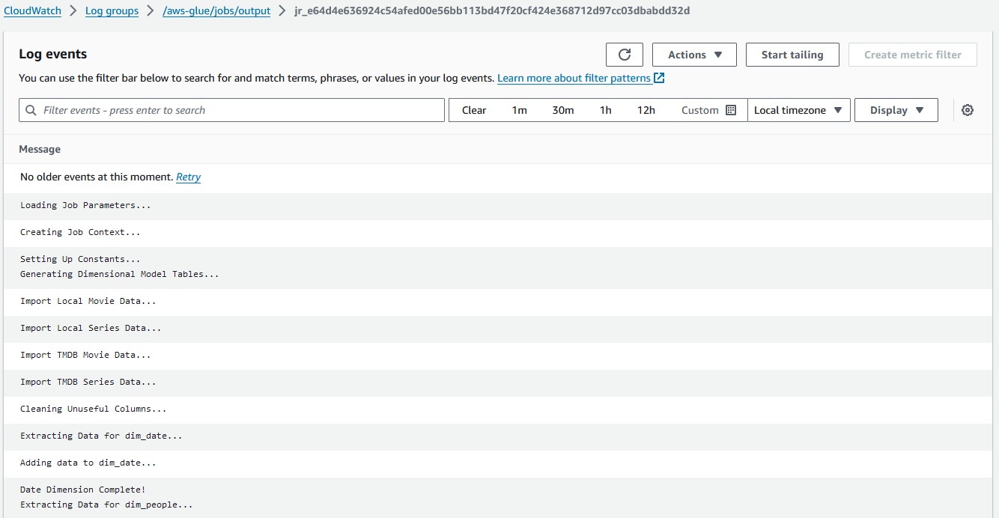
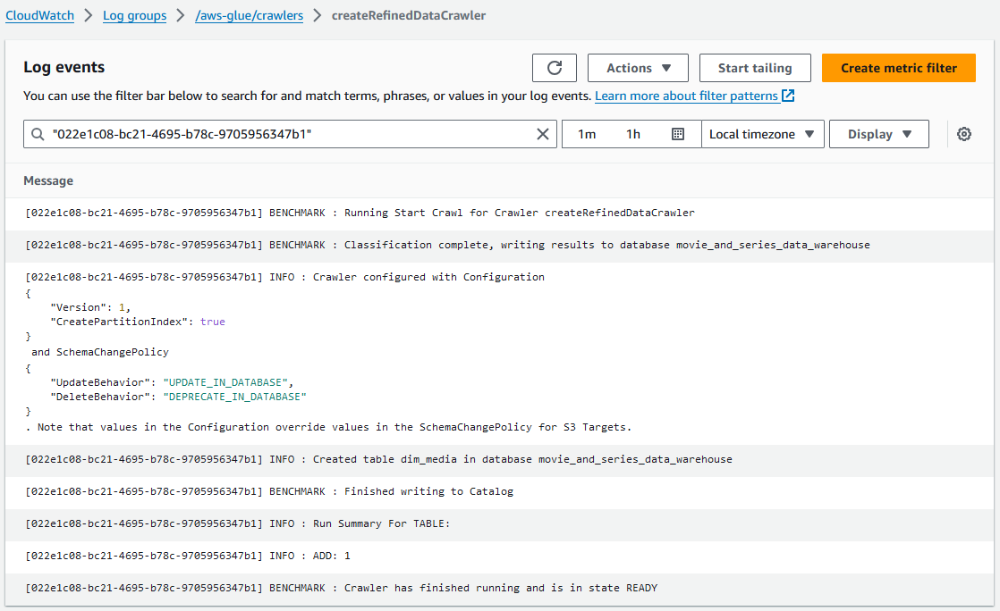

# Desafio

1. [Modelagem e Processamento para Camada Refined](Desafios/)

# Alterações das Atividades Anteriores

## Sprint 07: getDataFromTMDB

Todos os arquivos da nova função lambda criada podem ser encontrados na pasta [getDataFromTMDBv2](../Sprint%207/Desafios/getDataFromTMDBv2/).

### O que mudou?

A principal motivador para a mudança realizada foram os dados adquiridos nos endpoints [dicover/movie](https://developer.themoviedb.org/reference/discover-movie) e [dicover/tv](https://developer.themoviedb.org/reference/discover-tv). Apesar de permitir encontrar diversas mídias facilmente, esses endpoints oferecem relativamente pouca informação.


O endpoint que melhor oferece informações sobre as mídias são os endpoints [movie details](https://developer.themoviedb.org/reference/movie-details) e [tv details](https://developer.themoviedb.org/reference/tv-series-details). Apesar de conseguir realizar a consulta de apenas uma mídia por vez, esses endpoints permitem trazer o resultado de outros endpoints juntos, facilitando a busca dos atores participantes de cada mídia. 

```json
"Endpoints utilizados": {
    "Filmes": "https://api.themoviedb.org/3/movie/<id_placeholder>?append_to_response=credits&language=en-US",
    "Series": "https://api.themoviedb.org/3/tv/<id_placeholder>?append_to_response=credits&language=en-US"
}
```

As principais atualizações que a função lambda teve foram no arquivo de configuração ***config.json*** e a função ```generate_json_files``` no arquivo ***request_functions.py***.


 


## Sprint 08: createTrustedDataTMDB

Todos os arquivos do novo Glue Job criado podem ser encontrados na pasta [createTrustedDataTMDBv2](../Sprint%208/Desafios/createTrustedDataTMDBv2/).

### O que mudou?

A maior parte das alterações se encontra na função ```main``` já que os dados obtidos pelo novo endpoint possuem uma estrutura diferente. Entretano, o fluxo de execução do script continua o mesmo.


# Evidências

* Logs de execução do AWS Glue Job ```createRefinedData```:




* Logs de execução do AWS Glue Crawler ```createRefinedDataCrawler```:



* Estrutura de diretórios do S3 para os arquivos temporários de teste durante desenvolvimento dos Jobs do Glue.


* Estrutura de diretórios do S3 para os arquivos da camada ***Trusted***.


* Estrutura de diretórios do S3 para os arquivos da camada ***Refined***.

